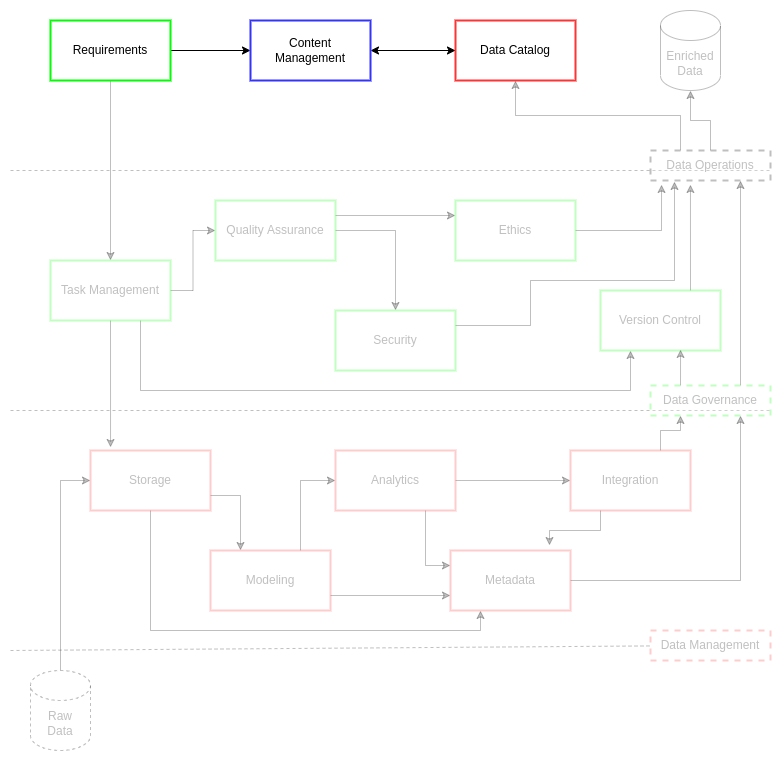

# Content Management

Content management is the gathering and organization of information in order to maintain the integrity of, and access to, knowledge artifacts[^1]. This form of management relies on a combination of consistent best practices and tooling which enable rigor in processes over time. Researchers have found this systematization of documentations workflows permits automation practices and clearer roles and responsibilities for content generation[^2]. Enhancing content generation in this way permits content management system (CMS) users to advance innovative practices while enriching other essential integrated practices such as metadata generation, best practice reuse, and improved collaboration. These procedural shifts in documentation practices reduce the need for presentations, drastically shortens the time on tasks to delivery, and improves quality of secure systems and products.

Content management is an essential part of modern knowledge-based systems. Moore in McKeever’s 2003 publication on content management systems stated, “Content is the feeder mechanism for all business processes. And always has been.”[^3] As a result, the more consistent and rigorous a content management standard (CMS) is implemented and reviewed by institutions and stakeholders, the more improvements in practices and outcomes can be observed. These outcomes, such as retrieval of information and inter-system integrations, ensure that personnel can respond to requests from leadership in a manner compliant to or exceeding stakeholder expectation[^1]. From the data-driven system perspective, the outcomes are increasingly reliable data models and metrics which enrich the analytics and knowledge-based system processes. As a result, collaborative efforts across an organization are more likely to accelerate their efforts through consolidated understanding of shared CMS resources.

There should not be a distinction between content and other types of data[^4]. In the organizational spaces, great attention is often placed on the data that is generated internally or acquired externally. However, it is equally important to understand and adopt the posture that documentation and metrics on the practices around internal and external data assets is equally, if not more, important. This posture is critical to the enrichment and searchability of content management systems as it necessitates continual metadata, cataloging, and data lifecycle management improvements. These improvements have a net positive effect on stakeholder impact and decision making.

A holistic approach to content management as a data asset bolsters several modern project and data operations practices. CMS can build content metadata, modeling, and delivery practices in a manner that adapts to multi-stakeholder paradigms through enabling knowledge discovery (KD)[^1]. This is done through practices of term management via ontology catalogs which link terms, definitions, and taxonomies to the managed data assets and project best practices. In this way, documents in a CMS act as records of policy for best practices that can be retrieved, implemented, and improved by stakeholders. When a CMS is paired with reliable information technology management (ITM), it makes search and discovery increasingly achievable for simplified implementation in project workflows. These workflows and their associated CMS practices lend to flexible and fast lifecycle management of data projects and their data assets for stakeholders and their institutions.

## Challenge

Data professionals face multiple content management challenges. There are often several parallel projects which share both personnel and resources. Sharing of resources across projects necessitates planning and coordination derived from best practices in both project and data management. Personnel with particular skill sets often have limited time in their work week to address tasks and deliverables prior to customer delivery. This short time to delivery combined with limited access to skilled personnel means project and data personnel are constrained in their ability to leverage each other and system architectures consistently. This inconsistency is often exacerbated through lack of documentation and content management, resulting in new personnel being slowly on-boarded up to an operational standards and more experienced personnel re-inventing previously implemented processes.

ciuTshi's suggests a tech-agnostic approach to consolidating project, data, and system documentation. This standard leverages simple template and rubric sets which encourage consistent documentation practices which could be implemented in any tool or content management system. Use of templates and rubrics permits rapid information exchange for inter-project migration of knowledge and personnel. This drastically increases on-ramp speeds, allowing for more time on-task prior to product or service delivery. Each template and rubric will be living documents that consolidate forms, definitions, and metrics; making process analysis and knowledge discovery possible.

## Goals

* Perform repeatable and rigorous documentation practices across all data project dimensions
* Ensure consistent storage, retrieval, and usage of documentation within and between project and data practices
* Enable packaging and sharing of project documentation for stakeholders

## Content Management Plan

ciuTshi uses a template and rubric approach to content generation and documentation.

### Templates

The __*templates*__ act as the forms through which consistent and rigorous details on best practices in project and data management are captured for operational and archival analysis of knowledge artifacts. Furthermore, templates act as means through which best practices become transferable techniques and methods.

* Each template should be associated with a best practices document (i.e., data requirements template is associated with the data governance requirements document).
* A templates are hierarchical and as a result may be a part of a large template process which in turn may have several sub-templates (take care to reference best practice documents and rubrics to ensure a template is complete along with sub-templates for a given practice).
* Any new templates should have a corresponding rubric: both should be reviewed to ensure they do not overlap or unnecessarily copy existing templates/rubrics.

### Rubrics

__*Rubrics*__ act as the guides through which templates are defined and implemented. Rubrics cover (at a minimum): field name, field category, field definition, intended benchmarks, and the measures or metrics expected.

* *Field name* is the label for a given field. If the label is a multi-word phrase, each word should be separated by underscores (e.g., `first_name`).
* *Field category* will vary from template to template. Categories are defined as options within the rubric for a given template.
* *Field definition* is a brief description of what the field should contain. Each field should have a concise, singular definition that captures a single thing.
* *Benchmarks* are the standards for how the content of a field should be structured or stated. This includes data types and any grammar to which a field should comply.
* *Metrics* are measurable features within a field, generally defining quantitative or qualitative standards, such as acceptability thresholds, for the field and its content.
  * *Weight* is the relevance factor for an element within the larger data model. These may vary between rubrics, but their implementation methodology must be documented each time.

### Structure

Templates and rubrics can be developed in any number of ways to suit the needs of the institution's data operations. Though each template element should have a corresponding rubric metadata element, these elements can be split between several sub-templates and sub-rubrics within a major modular practice area. This allows the content management of data operations information to adapt and shift with the organization's data practices.

### Access

Existing institutional policy regarding handling of varying levels of secure data should be observed when implementing content management practices. When in doubt, ask leadership and legal professionals to avoid unnecessary spillages or compromises of sensitive content.

### Tags, Labels, & Annotations

Institutions must consider what data elements to label and how those labels add annotated information and dimension to metadata. Tags, labels, and annotations code data asset elements to ensure that the context and utilization of a data asset from requirements to delivery is understood by current and future data management professionals. Each institution's tagging methodology will vary, but it is something that must be consistently and rigorously adhered to: noting shifts through robust metadata collection for provenance in order to analyze the longitudinal value of a data asset for an organization. This system of tags must be appropriately accessible to data customers on each system's content management system.

### Content Lifecycle Management

For the purposes of simplified guidance on lifecycle management:

* Ensure capturing content is part of every best practice and workflow via documentation
  * Create documents, templates/rubrics, metadata, and data assets as needed to support sustainable content management
  * Record these CMS artifacts in version controlled systems (VCS) with appropriate access and backup measures in place
* Timeline and document retention and disposal plans
  * Business requirements should capture the security and handling practices necessary for associated stakeholders
* Plan for content audits, edits, and delivery
  * Best practice and workflow execution should be paralleled by documentation of changes and innovations for a given content artifact
  * Documentation should be undertaken with the intent to package and share content artifacts with current and potential stakeholders
* Plan for periodic reviews and retrospectives of content
  * Content growth necessitates readiness and archival assessments for content
  * Reviews ensure personnel best practices are updated within documents and templates/rubrics
  * Retrospectives ensure that antiquated processes are assessed for risk, cost/benefit, and archive while optimizing best practices are elevated and updated to reflect overall improvements
* Improve the content management standard
  * Lifecycle management improves the quality of the CMS in the course of audit and review
  * Shifts in CMS should optimize search, discovery, and analysis of content artifacts^

## References

[^1]: Henderson, D., Earley, S., Sebastian-Coleman, L., Sykora, E., Smith, E. (Eds.). (2017). *DAMA-DMBOK: Data management body of knowledge (2nd Ed.).* Basking Ridge, NJ: Technics Publications.
[^2]: McCarthy, J.E., Grabill, J.T., Hart-Davidson, W., McLeod, M. (2011). Content Management in the Workplace: Community, Context, and a New Way to Organize Writing. *Journal of Business and Technical Communication*. 25(4), 367-395.
[^3]: McKeever, S. (2003). Understanding web content management systems: Evolution, lifecycle and market. *Industrial Management & Data Systems*, 103(8), 686-692.
[^4]: Ladley, J. (2019). *Data governance: How to design, deploy, and sustain an effective data governance program (2nd ed.)*. San Diego, CA: Academic Press.
