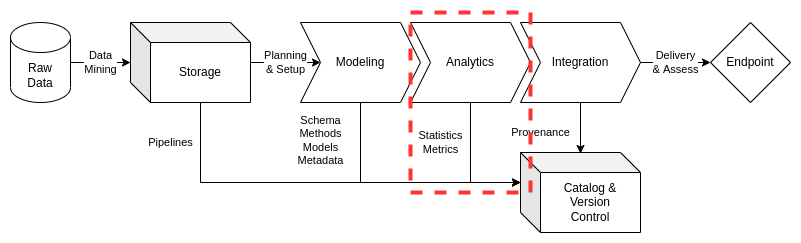

# Analytics

There is a need in data management for effective and sufficiently comprehensive analytics. As part of data processing, analytics produces consistent profiles for data that acts as a series of benchmark tests for the data model prior to integration. Analytics provides consumers of integration endpoints essential information on the model features and structures. This analytic output, stored in the data catalog, allows an institution's internal customers to make rapid assessments for additional data management requirements while making code and tool reuse simpler to assess and implement throughout the data management system.

This document will set a baseline for data analytics practices, directing data engineers to content management practices essential for simple and impactful data analytics implementations. ciuTshi's data management practices draws from DAMA[1](analytics/references) and other resources. For additional context on this document's sections, refer to the references section.

## Challenge

Institutions require data processes that can be optimized and enhanced for continued utilization of data assets. Metrics and information for process improvement allow data management, data owners, and external stakeholders to improved decision making on data asset lifecycle management. This data-driven direction for projects and their data assets requires improved data cataloging and metadata that promote statistical measures and metrics to inform decisions over time. Analytics, as part of the data management process, encourages mobilization of statistics, code, and documentation for value insight generation supported by valid metrics.

## Goals

* Produce statistics and metrics on modeling output resulting in rapid iteration on modeling issues and enriched integration outputs
* Expand the utilization of analytics measures in data management to enable the growth of data-driven decision making for leadership, internal customers, and external stakeholders
* Define tools and techniques that optimize analytic methods and models for data asset processes resulting in improved data governance utilities for the data management team

## Processes

### Preliminary Tasks

#### Security and System Compliance

Refer to the security and content management documents for guidance and templating of data analytics content. This should cover considerations on information system and guiding policies.

#### Role and Responsibilities

These are the roles currently associated with data analytics practices:

* Data Manager
* Deputy Data Manager
* Data Management Team
* Data Engineers
* Data Owners
* Data Stewards

Refer to the content management documents for analytics roles on different information systems, specific data architectures, and their associated policies and restrictions.

### Analytics

Due to the diversity of data assets handled by institutions across numerous projects and information systems, analytics will vary in form and approach. However, there are essential elements that need to be captured about the quality and effectiveness of the data management system as it exists within its particular data architecture. Analytics should pursue metrics on these dimensions:

* _Accuracy_ is difficult to measure, but should seek to quantify the degree to which the data model represents entities on the real world
* _Completeness_ observes what data is present, what data is missing, and what affect processing had on the raw data
* _Consistency_ observes the shifts or changes in data values and across data sets
* _Integrity_ observes the coherence between accuracy, completeness, and consistency between referential data and processed data or simpler factors, such as errors in the data
* _Reasonability_ checks if the modeled data outputs meet expected values
* _Timeliness_ observes the volatility of data changes, latency in production and use, or viability for use
* _Uniqueness_ observes factors such as de-duplication and entity resolution
* _Validity_ observes the conformity of values to data types and defined domains of value consistency

Metrics derived from these dimensions should account for these characteristics:

* _Measurable_ Metric has to observe something that is countable
* _Relevance_ Metrics that are relevant to the data consumer and data management team
* _Acceptance_ Metric is tied to requirement for the data
* _Stewardship_ Metrics are understood and usable by customers and stakeholders
* _Control_ Metric should indicate the data needs to be improved
* _Trends_ Metric enables analysis of data shifts over time

These analytics dimensions and others will ultimately be templated for metadata inclusion in the data catalog entry for each data asset. Additionally, the storage, modeling, and integration phases should capture basic data profiles to track shifts in the assets as they move from raw data to endpoint delivery. The profile may include:

* _Data Type and Format_
* _Storage Size of Data_
* _Data Shape_
* _Counts of Nulls_
* _Max/Min Value_
* _Max/Min Length_
* _Frequency Distribution_

_Cross-column analysis_ and _cross-table analysis_ should be used to address issues of overlap or redundancy. What follows are the sub-domain analytic considerations for modular phases in the data management system.

#### Raw Data for Modeling

Raw data assets will likely come in a variety of formats. However, attempts should be made to capture a basic data profile. This should be provided by data owner and/or data steward if possible. In the case of mined data, tooling outputs should attempt to cover as many of these data profile characteristics as possible. This profile will create the baseline for comparative analysis of the modeled data.

#### Modeled Data for Integration

Modeled data may experience significant transformations once it conforms to a schema or new format. In addition to the base data profile, scheme and model specific analysis should be conducted to ensure all major dimensions have representative metrics that ensure a secure, quality endpoint deliverable. These schema and model metrics will largely be data architecture specific and their level of sufficient detail will be at the discretion of the data engineer unless otherwise outlined in the data management system documentation.

### Advanced Data Analytics

ciuTshi suggests a flexible and simple approach to analytics in data management practices. However, due to the variety of data assets in use and the complexity of challenges for a given project or metric, analytics techniques may be adapted and advanced to adjust to the requirements and complexity of the data model and its associated metrics. Ensure to update documentation, metadata, and data catalog with this information.

(analytics/references)=

## References

Number|Reference
--|--
1|Henderson. D., Earley, S., Sebastian-Coleman, L., Sykora, E., Smith, E. (Eds.). (2017). *DAMA-DMBOK: Data management body of knowledge (2nd Ed.).* Basking Ridge, NJ: Technics Publications.
