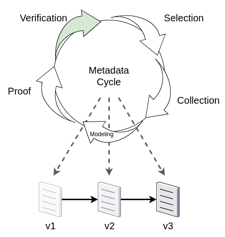

# Appendix - Templates and Rubrics

## Appendix A. Methodology

ciuTshi makes adaptable data operations simple. Despite the size and complexity of this appendix (and the overall framework), building metadata and process value are incremental and cummulative efforts. The challenge of generating rich metadata for modeling and analysis is a team effort, shared by several persons in the organization for which the data provides value. The aim of ciuTshi is to make the connection between the data and its value to the organization clear and valid for its users. What follows is a brief overview of an adaptable methodology for using this framework to gather and generate data asset value metrics.

### Verification

ciuTshi starts its data operations journey through clear requirements for a data asset. If your institution does not have a clear need for a data set or collection, nor a good value proposition for using people and resources to process the data into useable endpoint, it is not needed. Begin by reviewing and verifying the requirements with project leads, leadership, and other stakeholders who may provide clarity on the intent and purpose for a data asset request. If there is a clear justification for tasking a data engineering team with acquisition and curation of the data asset, start using dimensions, features, and user stories for the data to conceive of metrics which can validate process value for the institution (e.g., How does the use of this data impact the project and organization? How do I show this impact to leadership, stakeholders, and non-technical personnel?).

> Note: This step is where knowledge gaps are also identified. Even if the data is not accessible or is non-existent, an effort should be made to note the gap and what value the data, if present, would provide the organization. This will leave an ontological marker for later data enrichment via proxy data assets and/or metrics.

### Selection

Every modular practice in ciuTshi has a template and rubric to facilitate eventual population of metadata for a data asset: creating data provenance for the organization's metadata lineage. This process is a team effort with several data professionals tasked to action one or more modules for a given data asset. To begin, review the module's documentation: summary, template, rubric, and any worksheets that assist in populating metadata for the data asset. Each module has roles, each with their own responsibilities and tasks that may depend on or overlap with other modules, tasks, and roles. A number of data professionals and organizational team members facilitate these task and modules by performing one or more roles within and between modules. This approach to task management within data operations allow organizations with variable available personnel to layer and delgate tasks within reasonable deadlines for both delivery of the data asset and population of the metadata.

> Note: This represents a situation common for many organizations and is why ciuTshi's metatdata model is so critical: the connection between metadata and the socio-technical space of data operations is full of critical metrics that lend to quanitfying process value in data practices.

### Collection

Once requirements are validated and tasks are appropriately assigned, data professionals should collect and populate thier portion of the metadata in the process of facilitating their data engineering, management, and governance tasks. All fields in the rubric schema should be filled out as completely as possible. It is understood that you may not use all the fields at first, but it is recommended that you maintain the entire schema as future data requirements may expand the scope of metadata needs. This also ensures that as ciuTshi grows, augmenting your existing metadata collections is simplified.

Additionally, metadata collection should observe existing scientific research practices in population of the metadata rubrics. It is important to not make up data: null elements or empty fields are acceptable inputs if sufficient data is unavailable. It is important that every member of the data operations team agree to the consistent manner in which data is collected and entered into the rubric: noting the agreed method in the content management documents for the data project. It is recommended that this consistent data collection across all modules be rigorously adhered to within and between data projects: the more consistent and rigorous the metadata collection is, and the better shifts in these practices are tracked, the more valid the metric model outputs may be for decision-makers, stakeholders, and customers. This ability to validate metrics with collection practices aids in cross-validated review of those metrics with others throughout the organization.

> Note: Not every organization will use the same parts of ciuTshi in the same ways. The key focus should be to perform metatdata collection in a consistent, rigorous, and verfiable manner. This level of metadata quality assurance is critical for long-term review and verification of metrics for data operations.

### Modeling

In the requirements phase, we began asking critical questions to connect the data asset to its value impact for the project and as a result, the institution. After generating a rich and deep metadata collection for a data asset, we can now start adjusting and adding metrics to our fields for module- and asset-level modeling. Metrics are often organization specific, but may fall in several categories: descriptive, prescriptive, perceptive, interaction, outcome to name a few. Over time, each organization will develop and model their own sets of quanititative and qualitative metrics for their data assets. These metrics should be developed and documented as the organization's mission, vision, and goals shift: this helps leadership and stakeholders understand how value and impact change based on key indicators found in the metadata. Value should be at these metrics' loci, but it is by no means to only concern data professionals should have for a data asset. There may be quality, security, ethics, or other ensemble metrics derived from the organization's members, leadership, stakeholder networks, communities of practice, and other data partners.

There are also universals that exist across all data assets which add richness to the metadata for longitudinal analysis:

* __*weight*__ is a default metric that exists across all data elements. Weight can imply several things for a data asset and will be defined by each organization based on thier core metric requirements for data lifecycle management (documented in detail via content management), but the intial intent for the metric is to determine how important a metadata field is for the organization (on a scale from 0 to 1). This variable heuristic weight allows each data asset to be shaped by data professionals to reflect their organization's unique application of data operations for value generation and stakeholder impact.

> Note: Outside of data operations, other institutional teams and sections may have metrics that do not adhere to ciuTshi standards for comprehensive metadata collection and modeling. Efforts should be made to account for any connections within these external metrics that have direct implications for data asset impact on overall process value. Despite the technical and complex nature of some metrics, a non-technical team member must be able to understand the output of the model, its value, and its implications for institutional impact.

### Proof

Esblishment of models requires a persistent level of vigilance to ensure their validity. This validity requires several enagements with the model and its modelers to ensure the metrics prove what they claim to prove. This validation starts with a sanity check: does the model, metadata, metrics, and outputs make sense based on what we know about the data asset, its collection, and its utilization? Validation should then be socialized, opening communication with colleagues to ensure the model makes sense when walked-through the modeling process (observing appropriate security and other ethical research practices). Once internal colleagues review the model and validate its metrics, it may then call for peer-review with stakeholders and other reliable partners (preferrably a mix of specialized professionals with domain knowledge and astute non-technical persons with keen interrogation skills and curiosity). 

If data, system, and other necessary accesses are possible for a reviewer, there are a baseline of questions that would aid in maintaining proof of a metric's validity:

* Are the results reproducible?
* Is the model transferable?
* Are the results cross validated?
* Is proof understandable?

These steps in the process of validation ensure that a model mobilizes metadata production and utilization, keeping data systems and those that leverage them in a persistent state of constructive flow. This flow makes the cummulative and iterative cycle of metadata generation a systematic part of the data operations culture for the organization and its many talented professionals.

## Appendix B. Content Management

### Templates

These are questions associated with content management for a data asset. It is highly recommended that you collect all essential elements if possible in the course of content management practices.

* Who are the managers that direct content management?
* Who are the personnel associated with the data project or content management artifact?
* Who is the legal counsel that advises on the limits of the content management system?
* Who is the security point of contact for the content management system?
* What is the name of the data asset project?
* What legal restrictions exist for the data project?
* What security restrictions exist for the data project?
* Which templates are associated with the project?
* Which rubrics are associated with the project?
* What tags are associated with this project?
* What are the access policies and groups associated with this project?
* How is version control used in management of this project's content?
* How is task management used in the management of this project's operations and personnel?
* What are the operational tasks associated with the project's content management?
* What is the deprecation plan for the project's content?
* Where are the locations of the content documentation?
* Where are the locations of the content's associated assets?
* What is the timeframe for project content review and revision?

### Rubrics

The ciuTshi metamodel for metadata contains a set of baseline criteria. This can be adjusted based on the specific language or model metadata requirements. *Benchmarks* and *metrics* are flexible elements that can guide and enrich the metadata model for the institution's specific metadata needs.

* __*Benchmark*__ is the expected suitability measure or criteria for the metadata element.
  * *essential* elements are metric elements of information needed to ensure data retained in done so for measurable reason(s).
  * *non-essential* elements are elements that may not be relevant to the raw data asset of the institution in charge of the data asset.
  * *recommended* elements are recommended in cases where the raw data asset has set conditions upon it utilization or complexities in its interpretation.
* __*Metrics*__ is an extensible array of quantitative and qualitative features associated with the data asset element and can be augemented to suit an institutions metric requirements. *weight* is the only default feature in *metrics*
  * *weight* by default is set to `1` for each metadata element.

For more information, refer to the content management document.

field_name|category|definition|benchmark|metrics
--|--|--|--|--
cm_manager|content_management|manager that directs content management documentation and personnel|essential|['weight':1]
cm_personnel|content_management|personnel associated with curation and maintenance of content management assets|essential|['weight':1]
cm_legal|content_management|legal advisor for content management practices|essential|['weight':1]
cm_security|content_management|security advisor for content managment practices|essential|['weight':1]
cm_name|content_management|name of the data project|essential|['weight':1]
cm_legal_res|content_management|list of legal restrictions for data content|essential|['weight':1]
cm_security|content_management|list of security restrictions for data content|essential|['weight':1]
cm_templates|content_management|list of associated templates|essential|['weight':1]
cm_rubrics|content_management|list of associated rubrics|essential|['weight':1]
cm_tags|content_management|list of tags associated with the data project|essential|['weight':1]
cm_access|content_management|list of policies and groups associted with data project|essential|['weight':1]
cm_vcs|content_management|description and list of version control measures|essential|['weight':1]
cm_tms|content_management|description and list of task management measures|essential|['weight':1]
cm_ops|content_management|description and list of operations tasks associated with data project|essential|['weight':1]
cm_deprecation|content_management|description of deprecation measures|essential|['weight':1]
cm_doc_locs|content_management|list of documentation locations for the data project|essential|['weight':1]
cm_asset_locs |content_management|list of asset locations for the data project|essential|['weight':1]
cm_review|content_management|description of timeline for content review and revision|essential|['weight':1]

## Appendix C. Requirements

### Templates

These are questions associated with requirements gathering for a data asset. It is highly recommended that you collect all essential elements if possible in the course of requirements gathering practices.

* What system are reuquired to accomplish the data project?
* Who are the data owners for the data assets?
* From where do the data assets originate?
* Who and/or what produced the data asset?
* When was the data asset acquired by the owner?
* When will the data be obsolete or required to be deprecated?
* When was the requirements workshop conducted (list all dates)?
* When was the official request for information published?
* What is the task management plan for the data assets?
* What is the version control plan for the data assets?
* What is the conceptual model for the data asset?
* What is the logical model for the data asset?
* What is the cononical model for the data asset including the final schema?
* What is the revision plan for the data asset requirements?
* What addendums were added to the official requirements (if any)?
* What is the cancellation plan for the data asset requirements?

#### Request for Engineering

The request for engineering is a short form to capture essential elements of the requirements workshop. This can be expanded and apated to suite the needs of the particular workshop and its associated data assets. 

Name|Type|Description
--|--|--
timestamp|Timestamp|Datetime for request. Each adjustment (row) to the short form for a data product and/or service within a specified project will have a unique timestamp.
requester|String|Name(s) of those initiating the short form requirements.
requester_info|String|Contact information for the requester.
customer|String|Name(s) of those receiving the deliverables of a data product and/or service.
customer_info|String|Contact information for the customer.
project|String|Name of the project from which the requirements originated.
deliverable|String|A list of products and services requested by the customer.
data_source|String|A list of raw data resources associated with requirements.
data_poc|String|Name(s) of those originating and/or curating the data sources.
data_poc_info|String|Contact information for the data point of contact.
schema|String|The schema and data dictionary for the raw data.
data_format|String|The format(s) in which the raw data is stored and/or delivered.
data_type|String|The raw data types and their requested transformations.
metadata|String|A list of key-value pairs for all raw data metadata.
endpoint|String|The requested product and/or service delivery specifications.
ux_ui|String|Optional field for user experience or user interface specifications.
security|String|Optional field for data security practices.

### Rubrics

The ciuTshi metamodel for metadata contains a set of baseline criteria. This can be adjusted based on the specific language or model metadata requirements. *Benchmarks* and *metrics* are flexible elements that can guide and enrich the metadata model for the institution's specific metadata needs.

* __*Benchmark*__ is the expected suitability measure or criteria for the metadata element.
  * *essential* elements are metric elements of information needed to ensure data retained in done so for measurable reason(s).
  * *non-essential* elements are elements that may not be relevant to the raw data asset of the institution in charge of the data asset.
  * *recommended* elements are recommended in cases where the raw data asset has set conditions upon it utilization or complexities in its interpretation.
* __*Metrics*__ is an extensible array of quantitative and qualitative features associated with the data asset element and can be augemented to suit an institutions metric requirements. *weight* is the only default feature in *metrics*
  * *weight* by default is set to `1` for each metadata element.

For more information, refer to the Metadata document.

field_name|category|definition|benchmark|metrics
--|--|--|--|--
req_systems|requirements|list of the systems and sub-system resources required for the data asset project|essential|['weight':1]
req_owner|requirements|list of the names of the originating data owners and their associated organizational information|essential|['weight':1]
req_origin|requirements|list of the origins of the data assets with any lineage or provenance details|essential|['weight':1]
req_data_production|requirements|details pertaining to the means and methods used to produce the data assets|essential|['weight':1]
req_acquisition|requirements|dates and methods by which the data asset was acquired by the owner|essential|['weight':1]
req_deprecation|requirements|details on the end use date of the data asset with procedural information|essential|['weight':1]
req_workshop_con|requirements|the dates of the requirements workshop|essential|['weight':1]
req_rfe|requirements|the date the official requirements were published|essential|['weight':1]
req_tms|requirements|decription of the task management plan and setup for the data project|essential|['weight':1]
req_vcs|requirements|description of the version control plan and setup for the data project|essential|['weight':1]
req_conceptual_model|requirements|a high-level, real world customer data model concept(s) including the scheme and schema|essential|['weight':1]
req_logical_model|requirements|a detailed description of connections between data fields and conceptual model(s) including scheme and schema|essential|['weight':1]
req_canonical_model|requirements|the final scheme and schema for the data assets: often the same as mod_schema|essential|['weight':1]
req_rev|requirements|description of the revision and review plan for the requirements and addendums|essential|['weight':1]
req_addendums|requirements|a list and description of the addendums for the official published requirements: using the RFE template field to demonstrate changes|essential|['weight':1]
req_cancel|requirements|description of cancellation plan for redacted or terminated requirements|essential|['weight':1]

## Appendix D. Task Management

### Templates

These are questions associated with task managment for a data asset. It is highly recommended that you collect all essential elements if possible in the course of task management practices.

* Who is the manager for the task managment process?
* Who is the product owner who will oversee and receive the data asset?
* Who is the scrum master?
* Who are the scrum team personnel?
* Who are the other stakeholders involved in the data project tasks?
* Who are the other vendors involved in the data project tasks?
* What is the project name?
* What is the structure of the TMS boards?
* What are the structures of the boards' cards?
* What are the labels used in the TMS process?
* What is the timeline for the project?
* How is VCS of TMS artifacts handled for the project?
* What are the critical metrics for the project?
* What is the review plans for the TMS process?
* What are the elements of the completed MVP?
* What are the outcomes of the sprint retrospectives?
* Where are the TMS artifacts stored for the project?

#### Data Team Board Setup

The name of the board should be `Project Name - Data Team` where `Project Name` is the name of the project from which the requirements originated. The list names and descriptions are as follows:

Name|Description
--|--
Backlog|The list of task and subtasks derived from the project's business requirements.
Sprint Backlog|The selected and prioritized list of tasks and subtasks scope for completion during a sprint.
In Progress|Assigned sprint tasks in the process of being completed for a sprint.
Sprint dd.mm.yy - x Weeks|Completed sprint tasks for a given sprint.

There are special cards included by default with this template:

Card|List|Description
--|--|--
Product Owner: Name|Backlog|The contact information and additional information for the product owner.
Scrum Master: Name|Backlog|The contact information and additional information for the project scrum master.
Product Goal|Backlog|The product goal statement used to scope the tasks in the backlog. Included a __*Definition of Done*__ for the product.
Sprint Goal|Sprint dd.mm.yy - x Weeks|The sprint goal statement used to scope the tasks in the sprint backlog.

To assist the product owner and scrum master, colored label should also be used to signal status in a sprint.

Label Color|Description
--|--
Green|On Track
Yellow|Testing
Orange|Quality Control
Red|Blocker
Black|Done

### Rubrics

The ciuTshi metamodel for metadata contains a set of baseline criteria. This can be adjusted based on the specific language or model metadata requirements. *Benchmarks* and *metrics* are flexible elements that can guide and enrich the metadata model for the institution's specific metadata needs.

* __*Benchmark*__ is the expected suitability measure or criteria for the metadata element.
  * *essential* elements are metric elements of information needed to ensure data retained in done so for measurable reason(s).
  * *non-essential* elements are elements that may not be relevant to the raw data asset of the institution in charge of the data asset.
  * *recommended* elements are recommended in cases where the raw data asset has set conditions upon it utilization or complexities in its interpretation.
* __*Metrics*__ is an extensible array of quantitative and qualitative features associated with the data asset element and can be augemented to suit an institutions metric requirements. *weight* is the only default feature in *metrics*
  * *weight* by default is set to `1` for each metadata element.

For more information, refer to the Metadata document.

field_name|category|definition|benchmark|metrics
--|--|--|--|--
tms_manager|task_management|managers involved in the TMS processes|essential|['weight':1]
tms_owner|task_management|asset owners involved in the TMS processes|essential|['weight':1]
tms_scrum_master|task_management|scrum masters coordinating tasks and sprints|essential|['weight':1]
tms_scrum_team|task_management|team executing setup, sprint, and MVP tasks|essential|['weight':1]
tms_stakeholder|task_management|persons with responsibilities for TMS outcomes|essential|['weight':1]
tms_vendor|task_management|vendors facilitationg tasks within TMS processes|essential|['weight':1]
tms_project_name|task_management|name of the TMS projects for data assets|essential|['weight':1]
tms_board|task_management|description of the board setup with changes for a data project's TMS processes|essential|['weight':1]
tms_card|task_management|description of the card setup with changes for a data project's TMS processes|essential|['weight':1]
tms_label|task_management|description of the labels used for a data project's TMS processes|essential|['weight':1]
tms_timeline|task_management|description of the timeline to deadline including key review dates|essential|['weight':1]
tms_metrics|task_management|description of key metrics and models including burndown and velocity chart information|essential|['weight':1]
tms_rev|task_management|description of review plan for TMS processes including extensions and timeline shifts|essential|['weight':1]
tms_vcs|task_management|description of VCS plan for TMS assets and artifacts|essential|['weight':1]
tms_mvp|task_management|description of complete MVP to defintion of done standards including any changes|essential|['weight':1]
tms_retrospective|task_management|description of retrospective outcomes for each sprint|essential|['weight':1]
tms_artifacts|task_management|description of artifact locations and details on associated metrics|essential|['weight':1]

## Appendix E. Version Control

### Templates

These are questions associated with version control for a data asset. It is highly recommended that you collect all essential elements if possible in the course of version control practices.

* Who owns the repositories associated with the data project?
* Who has access to the repositories?
* Who are the reviews of repository activities?
* Who are the contributors to each repository?
* What vendors are used to facilitate VCS tasks?
* Where are VCS tasks being conducted?
* What is the project name?
* What are the repository names?
* What workflow model and schemes were used?
* What tags were applied to each repository?
* How is review of each repository handled?
* Where are artifacts associated with the repositories stored and managed?
* Where are the documents associated with the repository and source code stored and managed?
* What migration are associated with this repository?

#### GitFlow Process

There are several things to consider when setting up a repository for source code and documentation. These are a few of those consideration to establish ahead of linking VCS to TMS and other data operations practices:

* What is the repository naming convention?
  * Is there a `project digraph + tool name` convention or something else?
* Do you have a standard Readme template to capture essential elements of information?
  * Title
  * Description
  * Installation instructions
  * Usage instructions and limitations
* Do you have a `docs` directory convention?
  * Are you using Sphinx or another static site generator?
* Is there a Wiki in or connected to the repository?
* How are source code and documentation issues tracked?
* What license model is being used for the source code?
* Are there contribution guidelines for members of the project?
  * Is there instructions for member on workflow practices?
  * Is peer or mob coding practices used? If so, how?

#### Repository Template

The goal of using a standard repository template is maximum reuse of well-documented code and methods.

An example of this template is as follows (from the top of the repository):

* .gitignore
* README.md
  * Links/locations to CMS on information system(s)
* LICENSE.md
* CONTRIBUTING.md
* SECURITY.md
* data_ops
  * README.md
  * CONTRIBUTING.md
  * docs
    * requirements
      * README.md
    * task_management
      * README.md
    * methods_research
      * README.md
    * quality_assurance
      * README.md
    * images
      * README.md
  * data_management
    * storage
      README.md
      * pipelines
    * modeling
      README.md
    * analysis
      README.md
    * integration
      README.md

For each DMS section associated with code or tool methods, source folder content should maintain this baseline:

* models
  * model_a
    * README.md
    * source
    * tests

### Rubrics

The ciuTshi metamodel for metadata contains a set of baseline criteria. This can be adjusted based on the specific language or model metadata requirements. *Benchmarks* and *metrics* are flexible elements that can guide and enrich the metadata model for the institution's specific metadata needs.

* __*Benchmark*__ is the expected suitability measure or criteria for the metadata element.
  * *essential* elements are metric elements of information needed to ensure data retained in done so for measurable reason(s).
  * *non-essential* elements are elements that may not be relevant to the raw data asset of the institution in charge of the data asset.
  * *recommended* elements are recommended in cases where the raw data asset has set conditions upon it utilization or complexities in its interpretation.
* __*Metrics*__ is an extensible array of quantitative and qualitative features associated with the data asset element and can be augemented to suit an institutions metric requirements. *weight* is the only default feature in *metrics*
  * *weight* by default is set to `1` for each metadata element.

For more information, refer to the Metadata document.

field_name|category|definition|benchmark|metrics
--|--|--|--|--
vcs_owner|version_control|list all persons with admin access to each repository|essential|['weight':1]
vcs_member|version_control|list all persons with general access to each repository|essential|['weight':1]
vcs_reviewer|version_control|list all persons responsible for source code review|essential|['weight':1]
vcs_contributor|version_control|list all persons who modified or added to source code|essential|['weight':1]
vcs_vendor|version_control|list all persons or groups who provide services to aid in VCS tasks (e.g., CI/CD)|essential|['weight':1]
vcs_system|version_control|list all systems on which VCS tasks are conducted|essential|['weight':1]
vcs_project|version_control|name of the associated data project|essential|['weight':1]
vcs_license|version_control|name of license associated with source code and documentation|essential|['weight':1]
vcs_repo|version_control|list of all repo names and branches for a data project|essential|['weight':1]
vcs_workflow|version_control|description of VCS scheme and coding practice rules (e.g., GitFlow)|essential|['weight':1]
vcs_tags|version_control|list of tags applied to the repositories associate with a data project and broader data operations schemas|essential|['weight':1]
vcs_rev|version_control|description of the review practices for respositories|essential|['weight':1]
vcs_artifacts|version_control|list of all data connections and other essential elements associated with each repository|essential|['weight':1]
vcs_docs|version_control|list of locations for the repositories' documentation sources (e.g., readthedocs, wikis)|essential|['weight':1]
vcs_migrate|version_control|list of migrations to other repositories from the data project's collection with descriptions of rationale for migration|essential|['weight':1]

## Appendix F. Quality Assurance

### Templates

These are questions associated with quality assurance for a data asset. It is highly recommended that you collect all essential elements if possible in the course of quality assurance practices.

* Who are the managers for quality assurance of the data assets?
* Who are the quality assurance team members working on the data assets?
* Who are the data governance board members governing the data assets?
* What is the name of the data project?
* What are the accuracy standards for the data assets?
* What are the completeness standards for the data assets?
* What are the integrity standards for the data assets?
* What are the reasonability standards for the data assets?
* What are the timeliness standards for the data assets?
* What are the uniqueness standards for the data assets?
* What are the validty standards for the data assets?
* What are the quality assurance rules associated with the data assets?
* How are issues handles for the data assets?
* What are the profile models for the data assets?
* What are the quality assurance assessment outcomes for the data assets?
* What are the key metrics for the data assets?
* What is the strategy for the data assets?
* How is reporting handled for the data assets?
* Where are the quality assurance documents stores for the data assets?

### Rubrics

The ciuTshi metamodel for metadata contains a set of baseline criteria. This can be adjusted based on the specific language or model metadata requirements. *Benchmarks* and *metrics* are flexible elements that can guide and enrich the metadata model for the institution's specific metadata needs.

* __*Benchmark*__ is the expected suitability measure or criteria for the metadata element.
  * *essential* elements are metric elements of information needed to ensure data retained in done so for measurable reason(s).
  * *non-essential* elements are elements that may not be relevant to the raw data asset of the institution in charge of the data asset.
  * *recommended* elements are recommended in cases where the raw data asset has set conditions upon it utilization or complexities in its interpretation.
* __*Metrics*__ is an extensible array of quantitative and qualitative features associated with the data asset element and can be augemented to suit an institutions metric requirements. *weight* is the only default feature in *metrics*
  * *weight* by default is set to `1` for each metadata element.

For more information, refer to the Metadata document.

field_name|category|definition|benchmark|metrics
--|--|--|--|--
qa_manager|quality_assurance|list of managers associated with quality assurance for the data assets|essential|['weight':1]
qa_team|quality_assurance|list of team members associated with quality assurance tasks for the data assets including roles|essential|['weight':1]
qa_board|quality_assurance|list of data governance board members associated with guidance on data asset quality assurance tasks|essential|['weight':1]
qa_name|quality_assurance|name of the data project|essential|['weight':1]
qa_accuracy|quality_assurance|description of accuracy standards associated with the data assets|essential|['weight':1]
qa_completeness|quality_assurance|description of completeness standards associated with the data assets|essential|['weight':1]
qa_integrity|quality_assurance|description of integrity standards associated with the data assets|essential|['weight':1]
qa_reasonability|quality_assurance|description of reasonability standards associated with the data assets|essential|['weight':1]
qa_timeliness|quality_assurance|description of timeliness standards associated with the data assets|essential|['weight':1]
qa_uniqueness|quality_assurance|description of uniqueness standards associated with the data assets|essential|['weight':1]
qa_validity|quality_assurance|description of validity standards associated with the data assets|essential|['weight':1]
qa_rules|quality_assurance|description of quality assurance rules associated with the data assets|essential|['weight':1]
qa_issues|quality_assurance|description of the methodologies used to handle quality assurance issues|essential|['weight':1]
qa_profile|quality_assurance|description of the enhancements, analysis models, and outcomes associates with the quality assurance profile for each data asset|essential|['weight':1]
qa_assessment|quality_assurance|list of categories for each data asset with rationale|essential|['weight':1]
qa_metrics|quality_assurance|list of metrics for each data asset with descriptions of impacts and actions taken on quality assurance metrics for data assets|essential|['weight':1]
qa_strategy|quality_assurance|description of the data governance strategy for the data assets with location information for the strategy documentation|essential|['weight':1]
qa_report|quality_assurance|list of locations for logs and other forms of reporting for the data assets|essential|['weight':1]
qa_docs|quality_assurance|list of location for documentation associated with quality assurance for general guidance and data asset specific information|essential|['weight':1]

## Appendix G. Security

### Templates

These are questions associated with security for a data asset. It is highly recommended that you collect all essential elements if possible in the course of security practices.

* Who are the security managers associated with the data project?
* Who are the owners of the data assets?
* Who are the stewards for the data assets?
* Who are the infomation security managers associated with the data project?
* Who are the information assurance personnel associate with the data project?
* Who are the data governance board members associated with the data project?
* Who are the security team members associated with data project security tasks?
* What is the name of the data project?
* What are the tags associated with the data assets?
* How is access handled for the data assets and the data project?
* What are the security policies that apply to the data project and assets?
* What privacy measures are required for the data project and data assets?
* What are the authentication protocols in place for the data assets?
* What additional guidelines exist for the data assets?
* What are the key security metrics for the data assets?
* How is training handled for secure access to data project assets?

### Rubrics

The ciuTshi metamodel for metadata contains a set of baseline criteria. This can be adjusted based on the specific language or model metadata requirements. *Benchmarks* and *metrics* are flexible elements that can guide and enrich the metadata model for the institution's specific metadata needs.

* __*Benchmark*__ is the expected suitability measure or criteria for the metadata element.
  * *essential* elements are metric elements of information needed to ensure data retained in done so for measurable reason(s).
  * *non-essential* elements are elements that may not be relevant to the raw data asset of the institution in charge of the data asset.
  * *recommended* elements are recommended in cases where the raw data asset has set conditions upon it utilization or complexities in its interpretation.
* __*Metrics*__ is an extensible array of quantitative and qualitative features associated with the data asset element and can be augemented to suit an institutions metric requirements. *weight* is the only default feature in *metrics*
  * *weight* by default is set to `1` for each metadata element.

For more information, refer to the Metadata document.

field_name|category|definition|benchmark|metrics
--|--|--|--|--
sec_manager|security|list of managers associated with data project security|essential|['weight':1]
sec_owner|security|list of owners associated with the data assets|essential|['weight':1]
sec_steward|security|list of stewards responsible for tracking data asset security within the data project|essential|['weight':1]
sec_infosec_manager|security|list of institutional managers associated with data system security|essential|['weight':1]
sec_info_assurance|security|list of institutional personnel associated with data policy and guideline application to data project assets|essential|['weight':1]
sec_board|security|list of data governance board members associated with the data project security|essential|['weight':1]
sec_team|security|list of security team members responsible for data project security tasks including roles|essential|['weight':1]
sec_name|security|name of the data project|essential|['weight':1]
sec_tags|security|list of tags associated with the data project and data assets including access levels, security groups, and required credentials|essential|['weight':1]
sec_access|security|description of the group policy put in place for a data project and data assets|essential|['weight':1]
sec_policy|security|description of security regulation in place for the data project|essential|['weight':1]
sec_privacy|security|description of security features for data assets including masking, synthetic data, or other security models|essential|['weight':1]
sec_authentication|security|description of authentication practice requireds for the data project and data assets including required logs, metrics, and audits|essential|['weight':1]
sec_guidelines|security|description of specific guidance for each data assets with security action plan|essential|['weight':1]
sec_metrics|security|list of key security metrics for the data project and the data assets|essential|['weight':1]
sec_training|security|description of training requirement in place for the data project, data assets, and broader institutional certification requirements|essential|['weight':1]

## Appendix H. Ethics

### Templates

These are questions associated with ethics for a data asset. It is highly recommended that you collect all essential elements if possible in the course of ethics practices.

* Who are the managers associated with data asset ethics?
* Who are the data asset ownerx?
* Who are the data asset stewards?
* Who are the team members associated with ethical review for data asset utilization?
* Who are the data asset stakeholders?
* Who are the IRB team members associated with the data project?
* Who are the agencies associated with ethical practices for the data project?
* What is the code of coduct associated with ethical data practices?
* What was the consent process for the data assets and data project?
* Are there certification associated with data project ethics?
* What ethics policies are associated with the data project?
* What is the name of the data project?
* How was ethical acquisition of the data assets handled for the data project?
* How was ethical storage of the data assets handled for the data project?
* How was ethical processing of the data assets handled for the data project?
* How was ethical monitoring of the data assets handled for the data project?
* What are the impacts or potential impacts associated with ethical challenges for the data project?
* What metrics are leverage to aid in ethical standards for data assets and the data project?

### Rubrics

The ciuTshi metamodel for metadata contains a set of baseline criteria. This can be adjusted based on the specific language or model metadata requirements. *Benchmarks* and *metrics* are flexible elements that can guide and enrich the metadata model for the institution's specific metadata needs.

* __*Benchmark*__ is the expected suitability measure or criteria for the metadata element.
  * *essential* elements are metric elements of information needed to ensure data retained in done so for measurable reason(s).
  * *non-essential* elements are elements that may not be relevant to the raw data asset of the institution in charge of the data asset.
  * *recommended* elements are recommended in cases where the raw data asset has set conditions upon it utilization or complexities in its interpretation.
* __*Metrics*__ is an extensible array of quantitative and qualitative features associated with the data asset element and can be augemented to suit an institutions metric requirements. *weight* is the only default feature in *metrics*
  * *weight* by default is set to `1` for each metadata element.

For more information, refer to the Metadata document.

field_name|category|definition|benchmark|metrics
--|--|--|--|--
eth_manager|ethics|list of managers associated with ethics for data project|essential|['weight':1]
eth_owner|ethics|list of data owners associated with ethics for data project|essential|['weight':1]
eth_steward|ethics|list of data stewards associated with ethics for data project|essential|['weight':1]
eth_team|ethics|names and roles of persons associated with ethics for data project|essential|['weight':1]
eth_stakeholder|ethics|list of stakeholders associated with ethics for data project|essential|['weight':1]
eth_irb|ethics|institutional review boards associated with the data assets or data project|essential|['weight':1]
eth_agency|ethics|list of agencies associated with ethics for data project|essential|['weight':1]
eth_conduct|ethics|codes of conduct used to govern ethics for the data project|essential|['weight':1]
eth_consent|ethics|consent practics associated with data assets and the data project|essential|['weight':1]
eth_certification|ethics|list of certifications required for ethical data practices for data project|essential|['weight':1]
eth_policy|ethics|policies guiding ethical practices for data project|essential|['weight':1]
eth_name|ethics|names of the data assets|essential|['weight':1]
eth_acquisition|ethics|description of methods of ethical data acquisition used for each data asset|essential|['weight':1]
eth_storage|ethics|description of methods of ethical data storage used for each data asset access|essential|['weight':1]
eth_process|ethics|description of methods of ethical data processing used for each data asset delivery|essential|['weight':1]
eth_monitor|ethics|description of methods of ethical data monitoring used for each data asset and their deprecation|essential|['weight':1]
eth_impact|ethics|description of impacts associated with ethical outcomes|essential|['weight':1]
eth_metrics|ethics|list of key metrics for measuring ethical standards used for each data asset and the data projects|essential|['weight':1]

## Appendix I. Storage

### Templates

These are questions associated with storage of data. It is highly recommended that you collect all essential elements if possible in the course of data management practices for data storage.

* Who is the manager that directs data storage practices and personnel?
* Who is the data manager that assists the primary data manager (if exists)?
* Who is the manager that runs a project for which a raw data asset is required?
* Who is the legal counsel that advises on the legal limits for use of a raw data asset?
* Who is the project manager that assists the primary project manager
* Who is on the team that supports the data manager and/or deputy data manager?
* Who is on the team that supports the project manager and/or project lead?
* Who is the engineer that supports the data management team?
* Who is the owner that produced the raw data asset?
* Who is the steward that moves the raw data asset to the data manager?
* Who is the security agent that is in charge of tracking loading of and access to raw data assets?
* What is the name of the stored raw data asset?
* What type of raw data asset (e.g., reference, critical, project)?
* Where is the requirements reference for a raw data asset?
* Is there a form completed for the loading of a raw data asset?
* Is there a form completed for accessing to a raw data asset?
* How is the data team handling task management for raw data asset tasks?
* How is the data team handling version control for data loading methods and code?
* Was data mining used for sourcing the raw data? What methods were used for the mined data?
* What pipeline models, tools and/or code for processing raw data into storage are used?
* Where is the raw data stored?
* Where is the master data derived from the raw data stored?
* Are there any addendums or changes to the raw data requirements?If so, please describe in detail with references.
* What is the monitoring plan for the raw data (including retention and deprecation plan)?

### Rubrics

The ciuTshi metamodel for metadata contains a set of baseline criteria. This can be adjusted based on the specific language or model metadata requirements. *Benchmarks* and *metrics* are flexible elements that can guide and enrich the metadata model for the institution's specific metadata needs.

* __*Benchmark*__ is the expected suitability measure or criteria for the metadata element.
  * *essential* elements are metric elements of information needed to ensure data retained in done so for measurable reason(s).
  * *non-essential* elements are elements that may not be relevant to the raw data asset of the institution in charge of the data asset.
  * *recommended* elements are recommended in cases where the raw data asset has set conditions upon it utilization or complexities in its interpretation.
* __*Metrics*__ is an extensible array of quantitative and qualitative features associated with the data asset element and can be augemented to suit an institutions metric requirements. *weight* is the only default feature in *metrics*
  * *weight* by default is set to `1` for each metadata element.

For more information, refer to the Metadata document.

field_name|category|definition|benchmark|metrics
--|--|--|--|--
sto_data_manager|storage|manager that directs data storage practices and personnel|essential|['weight':1]
sto_deputy_data_manager|storage|data manager that assists the primary data manager (if exists)|optional|['weight':1]
sto_project_manager|storage|manager that runs a project for which a raw data asset is required|essential|['weight':1]
sto_legal_counsel|storage|counsel that advises on the legal limits for use of a raw data asset|optional|['weight':1]
sto_project_lead|storage|project manager that assists the primary project manager|optional|['weight':1]
sto_data_management_team|storage|team that supports the data manager and/or deputy data manager|essential|['weight':1]
sto_project_team|storage|team that supports the project manager and/or project lead|optional|['weight':1]
sto_data_engineer|storage|engineer that supports the data management team|essential|['weight':1]
sto_data_owner|storage|owner that produced the raw data asset|essential|['weight':1]
sto_data_steward|storage|steward that moves the raw data asset to the data manager|essential|['weight':1]
sto_tta|storage|security agent that is in charge of tracking loading of and access to raw data assets|essential|['weight':1]
sto_data_asset_name|storage|name of the stored raw data asset|essential|['weight':1]
sto_type|storage|type of raw data asset (e.g., reference, critical, project)|essential|['weight':1]
sto_requirements|storage|requirements reference for a raw data asset|essential|['weight':1]
sto_load_form|storage|form reference for the loading of a raw data asset|essential|['weight':1]
sto_access_form|storage|form reference for the access to a raw data asset|essential|['weight':1]
sto_task_management|storage|task management reference for data management team's raw data asset tasks|essential|['weight':1]
sto_version_control|storage|version control reference for data engineer(s) data loading methods and code|essential|['weight':1]
sto_data_mining|storage|data mining references for sourcing and methods of mined data|recommended if data mining conducted, else optional|['weight':1]
sto_pipelines|storage|pipeline references for models, tools and/or code for processing raw data into storage|essential|['weight':1]
sto_raw_data_location|storage|location reference(s) of raw data storage|essential|['weight':1]
sto_master_data_location|storage|location reference(s) of master data storage|essential|['weight':1]
sto_addendum|storage|form reference for the change in storage to a raw data asset|recommended if addendums generated, else optional|['weight':1]
sto_monitoring|storage|reference for the retention and deprication to all data assets|essential|['weight':1]

## Appendix J. Modeling

### Templates

These are questions associated with modeling of data. It is highly recommended that you collect all essential elements if possible in the course of data management practices for data modeling.

* Who is the data manager that directs data modeling practices and personnel
* Who is the data manager that assists the primary data manager with modeling(if exists)?
* Who is on the team that supports the data manager and/or deputy data manager with modeling?
* Who is the engineer(s) that support the data management team with modeling?
* Who are the data personnel that produced the modeled data asset(s)?
* Who is the data steward that moves the raw data asset to and from data management team modeling?
* How is task management handled for the data modeling tasks?
* How is version control handled for the data modeling methods and code?
* What is the scheme(s) for the final data model?
* What is the schema(s) for the final data model (including data types)?
* What methods derived from methodologies were used in the modeling of the data asset?
* What is the overall model approach?
* Who are the reviewer(s) of the final model elements including scheme, schema, methods, and other essential features?
* What are the tags for the model's associated categories?
* What are the ontological entities that are linked to the modeled data features?
* What is the dictionary reference for the modeled data schema features (e.g., data dictionary)?
* How was the data tranformed for the final data model?
* How was the data normalized for the final data model?
* What is the sampling method suggested for the data asset?
* Was synthetic data recommended for use of the data asset? If so, what is the method used?
* Was entity resolution used for the data asset model? If so, what is the method used?
* What challenges existed with the final model? Is there any additional context that should be noted about the modeled data?

### Rubrics

The ciuTshi metamodel for metadata contains a set of baseline criteria. This can be adjusted based on the specific language or model metadata requirements. *Benchmarks* and *metrics* are flexible elements that can guide and enrich the metadata model for the institution's specific metadata needs.

* __*Benchmark*__ is the expected suitability measure or criteria for the metadata element.
  * *essential* elements are metric elements of information needed to ensure data retained in done so for measurable reason(s).
  * *non-essential* elements are elements that may not be relevant to the raw data asset of the institution in charge of the data asset.
  * *recommended* elements are recommended in cases where the raw data asset has set conditions upon it utilization or complexities in its interpretation.
* __*Metrics*__ is an extensible array of quantitative and qualitative features associated with the data asset element and can be augemented to suit an institutions metric requirements. *weight* is the only default feature in *metrics*
  * *weight* by default is set to `1` for each metadata element.

For more information, refer to the Metadata document.

field_name|category|definition|benchmark|metrics
--|--|--|--|--
mod_data_manager|modeling|manager that directs data modeling practices and personnel|essential|['weight':1]
mod_deputy_data_manager|modeling|data manager that assists the primary data manager with modeling(if exists)|optional|['weight':1]
mod_data_management_team|modeling|team that supports the data manager and/or deputy data manager with modeling|essential|['weight':1]
mod_data_engineer|modeling|engineer(s) that support the data management team with modeling|essential|['weight':1]
mod_data_owner|modeling|data personnel that produced the modeled data asset(s)|essential|['weight':1]
mod_data_steward|modeling|steward that moves the raw data asset to and from data management team modeling|essential|['weight':1]
mod_task_management|modeling|task management reference for data management team's data modeling tasks|essential|['weight':1]
mod_version_control|modeling|version control reference for data engineer(s) data modeling methods and code|essential|['weight':1]
mod_scheme|modeling|scheme(s) for the final data model|essential|['weight':1]
mod_schema|modeling|schema(s) for the final data model including data types|essential|['weight':1]
mod_methods|modeling|methods derived from methodologies used in the modeling of the data asset|essential|['weight':1]
mod_description|modeling|description that outlines the overall model approach|essential|['weight':1]
mod_reviewers|modeling|reviewer(s) of the final model elements including scheme, schema, methods, and other essential features|essential|['weight':1]
mod_tags|modeling|tags for the model's associated categories|essential|['weight':1]
mod_entities|modeling|entities that are linked to the modeled data features|essential|['weight':1]
mod_dictionary|modeling|dictionary reference for the modeled data schema features|essential|['weight':1]
mod_transformation|modeling|tranformation details for the final data model|essential|['weight':1]
mod_normalization|modeling|normalization details for the final data model|essential|['weight':1]
mod_sampling|modeling|sampling method suggested for the data asset, used primarily in analytics and the data catalog|essential|['weight':1]
mod_synthetic|modeling|synthetic data reference used for a raw data asset|optional|['weight':1]
mod_entity_res|modeling|entity resolution reference used for a data asset model|optional|['weight':1]
mod_challenge|modeling|challenges that existed with the final model|essential|['weight':1]

## Appendix K. Analytics

### Templates

These are questions associated with data analytics. It is highly recommended that you collect all essential elements if possible in the course of data management practices for data asset analytics.

* Who is the manager that directs data management analytics practices and personnel?
* Who is the data manager that assists the primary data manager with analytics(if exists)?
* Who is the team that supports the data manager and/or deputy data manager with analytics?
* Who is the engineer(s) that support the data management team with analytics?
* Who are the data personnel that retain the modeled data asset(s) for analytics?
* Who is the steward that moves the modeled data asset to and from data management team analytics?
* How is task management handled for data analytics tasks?
* How is version control handled for data analytics methods and code?
* What are the accuracy metrics of the modeled data asset(s)?
* What are the completeness metrics of the modeled data asset(s)?
* What are the consistency metrics of the modeled data asset(s)?
* What are the integrity metrics of the modeled data asset(s)?
* What are the reasonability metrics of the modeled data asset(s)?
* What are the timeliness metrics of the modeled data asset(s)?
* What are the uniqueness metrics of the modeled data asset(s)?
* What are the validity metrics of the modeled data asset(s)?
* What is the size of the modeled data asset(s) when stored?
* What is the size of the raw data asset(s) when stored?
* What is the shape of the modeled data asset(s)?
* What is the shape of the raw data asset(s)?
* What is the statistical profile of the modeled data asset(s) features including nulls, value ranges, data types, and frequency distributions?
* What is the statistical profile of the raw data asset(s) features including nulls, value ranges, data types, and frequency distributions?
* What is the format of the modeled data going through analytics processes?

### Rubrics

The ciuTshi metamodel for metadata contains a set of baseline criteria. This can be adjusted based on the specific language or model metadata requirements. *Benchmarks* and *metrics* are flexible elements that can guide and enrich the metadata model for the institution's specific metadata needs.

* __*Benchmark*__ is the expected suitability measure or criteria for the metadata element.
  * *essential* elements are metric elements of information needed to ensure data retained in done so for measurable reason(s).
  * *non-essential* elements are elements that may not be relevant to the raw data asset of the institution in charge of the data asset.
  * *recommended* elements are recommended in cases where the raw data asset has set conditions upon it utilization or complexities in its interpretation.
* __*Metrics*__ is an extensible array of quantitative and qualitative features associated with the data asset element and can be augemented to suit an institutions metric requirements. *weight* is the only default feature in *metrics*
  * *weight* by default is set to `1` for each metadata element.

For more information, refer to the Metadata document.

field_name|category|definition|benchmark|metrics
--|--|--|--|--
ana_data_manager|analytics|manager that directs data analytics practices and personnel|essential|['weight':1]
ana_deputy_data_manager|analytics|data manager that assists the primary data manager with analytics(if exists)|optional|['weight':1]
ana_data_management_team|analytics|team that supports the data manager and/or deputy data manager with analytics|essential|['weight':1]
ana_data_engineer|analytics|engineer(s) that support the data management team with analytics|essential|['weight':1]
ana_data_owner|analytics|data personnel that retains the modeled data asset(s) for analytics|essential|['weight':1]
ana_data_steward|analytics|steward that moves the modeled data asset to and from data management team analytics|essential|['weight':1]
ana_task_management|analytics|task management reference for data management team's data analytics tasks|essential|['weight':1]
ana_version_control|analytics|version control reference for data engineer(s) data analytics methods and code|essential|['weight':1]
ana_accuracy|analytics|accuracy metrics of the modeled data asset(s)|essential|['weight':1]
ana_completeness|analytics|completeness metrics of the modeled data asset(s)|essential|['weight':1]
ana_consistency|analytics|consistency metrics of the modeled data asset(s)|essential|['weight':1]
ana_integrity|analytics|integrity metrics of the modeled data asset(s)|essential|['weight':1]
ana_reasonability|analytics|reasonability metrics of the modeled data asset(s)|essential|['weight':1]
ana_timeliness|analytics|timeliness metrics of the modeled data asset(s)|essential|['weight':1]
ana_uniqueness|analytics|uniqueness metrics of the modeled data asset(s)|essential|['weight':1]
ana_validity|analytics|validity metrics of the modeled data asset(s)|essential|['weight':1]
ana_data_size_model|analytics|size of the modeled data asset(s) when stored|essential|['weight':1]
ana_data_size_raw|analytics|size of the raw data asset(s) when stored|essential|['weight':1]
ana_data_shape_model|analytics|shape of the modeled data asset(s)|essential|['weight':1]
ana_data_shape_raw|analytics|shape of the raw data asset(s)|essential|['weight':1]
ana_descriptive_statistics_model|analytics|statistical profile of the modeled data asset(s) features including nulls, value ranges, data types, and frequency distributions|essential|['weight':1]
ana_descriptive_statistics_raw|analytics|statistical profile of the raw data asset(s) features including nulls, value ranges, data types, and frequency distributions|essential|['weight':1]
ana_format|analytics|the format of the modeled data going through analytics processes|essential|['weight':1]

## Appendix L. Integration

### Templates

These are questions associated with data integration. It is highly recommended that you collect all essential elements if possible in the course of data management practices for data integration.

* Who is the manager that directs data integration practices and personnel?
* Who is the data manager that assists the primary data integration manager (if exists)?
* Who is the project manager overseeing integration of the modeled data?
* Who is the counsel that advises on the legal limits for integration of a modeled data asset?
* Who is the project lead in receiving the data integration?
* Who is the on the team that supports the data integration manager and/or deputy data manager?
* Who is the project team in charge of receiving the data integration?
* Who is the engineer that supports the data integration management team?
* Who is the owner that produced or controls the modeled data asset?
* Who is the steward that moves the modeled data integration to the data manager?
* Who is the security agent that is in charge of tracking loading of and access to modeled data assets and integrations?
* What is the overall plan for the integration endpoint deployment and delivery?
* What is the assessment of proposed final integration behaviors and outputs including format, quality, documentation, metadata lineage updates, data asset provenance, analytic metrics, and policy compliance?
* What are the resources and personnel tasked to implement the integration endpoint design?
* What database(s) were used for the integration endpoint solution?
* What are the API details for the integration endpoint solution?
* What are the developement details for the integration endpoint solution including testing and logging information?
* What are the date(s) and time(s) the intgration endpoint was first accessed by the customer?
* What are the date(s) and time(s) the intgration endpoint ceased to be available to the customer?
* Describe of how the data asset is used by the customer from the endpoint?
* Decribe the monitoring details, metrics, and actions to be conducted for a deployed endpoint until end of lifecycle?

### Rubrics

The ciuTshi metamodel for metadata contains a set of baseline criteria. This can be adjusted based on the specific language or model metadata requirements. *Benchmarks* and *metrics* are flexible elements that can guide and enrich the metadata model for the institution's specific metadata needs.

* __*Benchmark*__ is the expected suitability measure or criteria for the metadata element.
  * *essential* elements are metric elements of information needed to ensure data retained in done so for measurable reason(s).
  * *non-essential* elements are elements that may not be relevant to the raw data asset of the institution in charge of the data asset.
  * *recommended* elements are recommended in cases where the raw data asset has set conditions upon it utilization or complexities in its interpretation.
* __*Metrics*__ is an extensible array of quantitative and qualitative features associated with the data asset element and can be augemented to suit an institutions metric requirements. *weight* is the only default feature in *metrics*
  * *weight* by default is set to `1` for each metadata element.

For more information, refer to the Metadata document.

field_name|category|definition|benchmark|metrics
--|--|--|--|--
int_data_manager|integration|manager that directs data integration practices and personnel|essential|['weight':1]
int_deputy_data_manager|integration|data manager that assists the primary data integration manager (if exists)|optional|['weight':1]
int_project_manager|integration|the manager in charge of receiving the integration (possibly same as sto_project_manager)|essential|['weight':1]
int_legal_counsel|integration|counsel that advises on the legal limits for integration of a modeled data asset|optional|['weight':1]
int_project_lead|integration|The lead in charge of guiding implementation of the integration (possibly same as sto_project_lead)|optional|['weight':1]
int_data_management_team|integration|team that supports the data integration manager and/or deputy data manager|essential|['weight':1]
int_project_team|integration|the team in charge of implementing the integration (possibly same as sto_project_team)|optional|['weight':1]
int_data_engineer|integration|engineer that supports the data integration management team|essential|['weight':1]
int_data_owner|integration|owner that produced or controls the modeled data asset|essential|['weight':1]
int_data_steward|integration|steward that moves the modeled data integration to the data manager|essential|['weight':1]
int_tta|integration|security agent that is in charge of tracking loading of and access to modeled data assets and integrations|essential|['weight':1]
int_plan|integration|plan description for the integration endpoint deployment and delivery|essential|['weight':1]
int_assessment|integration|assessment of proposed final integration behaviors and outputs including format, quality, documentation, metadata lineage updates, data asset provenance, analytic metrics, and policy compliance|essential|['weight':1]
int_design|integration|description of resources and personnel tasked to implement the integration endpoint design|essential|['weight':1]
int_database|integration|database details for the integration endpoint solution|recommended if database used, else optional|['weight':1]
int_api|integration|api details for the integration endpoint solution|recommended if api used, else optional|['weight':1]
int_development|integration|developement details for the integration endpoint solution including testing and logging information|essential|['weight':1]
int_endpoint_implemented|integration|date and time the intgration endpoint was first accessed by the customer (this may be several datatimes, each needing an explanation)|essential|['weight':1]
int_endpoint_deprecated|integration|date and time the intgration endpoint ceased to be available to the customer (this may be several datatimes, each needing an explanation)|essential|['weight':1]
int_provenance|integration|description of how the data asset is used by the customer from the endpoint|essential|['weight':1]
int_monitoring|integration|description of monitoring details, metrics, and actions to be conducted for a deployed endpoint until end of lifecycle|essential|['weight':1]

## Appendix M. Metadata

### Templates

These are questions associated with metadata for a data asset. It is highly recommended that you collect all essential elements if possible in the course of data management practices for metadata. This section in particular can draw from all other sections as Appendix A is the metamodel for metadata.

* What is the scheme for the data asset's categorical metadata areas?
* What tags are associated with the data asset?
* Which personnel contributed to the metadata for a data asset?
* What was the metadata strategy for the data asset?
* How is version control managed for the metadata assets?
* How is the metadata to be maintained?

### Rubrics

The ciuTshi metamodel for metadata contains a set of baseline criteria. This can be adjusted based on the specific language or model metadata requirements. *Benchmarks* and *metrics* are flexible elements that can guide and enrich the metadata model for the institution's specific metadata needs.

* __*Benchmark*__ is the expected suitability measure or criteria for the metadata element.
  * *essential* elements are metric elements of information needed to ensure data retained in done so for measurable reason(s).
  * *non-essential* elements are elements that may not be relevant to the raw data asset of the institution in charge of the data asset.
  * *recommended* elements are recommended in cases where the raw data asset has set conditions upon it utilization or complexities in its interpretation.
* __*Metrics*__ is an extensible array of quantitative and qualitative features associated with the data asset element and can be augemented to suit an institutions metric requirements. *weight* is the only default feature in *metrics*
  * *weight* by default is set to `1` for each metadata element.

For more information, refer to the Metadata document.

field_name|category|definition|benchmark|metrics
--|--|--|--|--
met_metamodel|metadata|scheme description for the data asset's categorical metadata areas|essential|['weight':1]
met_tags|metadata|tags associated with the data asset metadata considerations including type, associated projects, security labels, and associated policy restrictions|essential|['weight':1]
met_editors|metadata|list of personnel contributing to the metadata for a data asset|essential|['weight':1]
met_strategy|metadata|strategy for use of a data asset via metadata element (e.g., knowledge discovery) including migrations|essential|['weight':1]
met_vcs|metadata|link to version control for metadata assets|essential|['weight':1]
met_schedule|metadata|schedule and practice details associated with metadata maintenance including review and enrichment|essential|['weight':1]

## Appendix N. Cataloging

### Templates

These are questions associated with cataloging of data. It is highly recommended that you collect all essential elements if possible in the course of data management practices for data cataloging.

* Who manages data cataloging practices and personnel for the data asset?
* Who assists the primary data catalog manager (if exists)?
* Who is the counsel that advises on the legal limits for use of a cataloged metadata or master data samples?
* Who is the team that supports the data manager and/or deputy data manager?
* Who is the engineer that supports the data catalog management?
* Who owns the master data sample?
* Who is the steward that moves the master data sample to the data manager?
* What annotations are associated with the cataloged data record?
* What feedback method(s) are available for the data sample and associated metadata entry?
* What is the monitoring plan for the data catalog?

### Rubrics

The ciuTshi metamodel for metadata contains a set of baseline criteria. This can be adjusted based on the specific language or model metadata requirements. *Benchmarks* and *metrics* are flexible elements that can guide and enrich the metadata model for the institution's specific metadata needs.

* __*Benchmark*__ is the expected suitability measure or criteria for the metadata element.
  * *essential* elements are metric elements of information needed to ensure data retained in done so for measurable reason(s).
  * *non-essential* elements are elements that may not be relevant to the raw data asset of the institution in charge of the data asset.
  * *recommended* elements are recommended in cases where the raw data asset has set conditions upon it utilization or complexities in its interpretation.
* __*Metrics*__ is an extensible array of quantitative and qualitative features associated with the data asset element and can be augemented to suit an institutions metric requirements. *weight* is the only default feature in *metrics*
  * *weight* by default is set to `1` for each metadata element.

For more information, refer to the Metadata document.

field_name|category|definition|benchmark|metrics
--|--|--|--|--
cat_data_manager|cataloging|manager that directs data cataloging practices and personnel|essential|['weight':1]
cat_deputy_data_manager|cataloging|data manager that assists the primary data manager (if exists)|optional|['weight':1]
cat_legal_counsel|cataloging|counsel that advises on the legal limits for use of a cataloged metadata or master data samples|optional|['weight':1]
cat_data_management_team|cataloging|team that supports the data manager and/or deputy data manager|essential|['weight':1]
cat_data_engineer|cataloging|engineer that supports the data management team|essential|['weight':1]
cat_data_owner|cataloging|owner that produced the master data sample|essential|['weight':1]
cat_data_steward|cataloging|steward that moves the master data sample to the data manager|essential|['weight':1]
cat_annotations|cataloging|annotations on a cataloged data record annotation special access or handling instructions for specific sections of the metadata within and outside of the catalog|essential|['weight':1]
cat_feedback|cataloging|feedback method(s) associated with a data sample for catalog users|essential|['weight':1]
cat_monitoring|cataloging|monitoring plan for the data catalog|essential|['weight':1]
