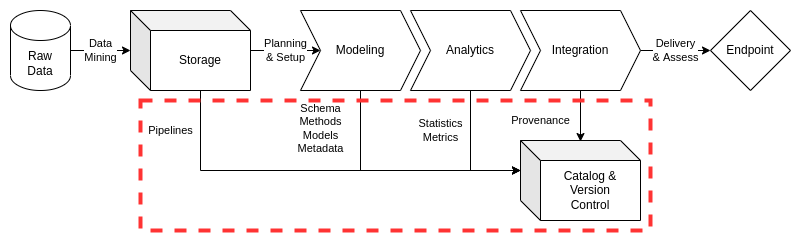

# Cataloging

Tracking the legacy of data assets for an organization is essential to their data strategy and data governance plans. In order to maintain accurate data inventories across multiple information systems and data architectures, an organization must actively monitor and archive essential artifacts from key phases in the their data operations practices. Active and persistent cataloging of data artifacts allows data management teams to avoid pitfalls such as loss of provenance, unclear lineage, and inconsistent profile resolution between raw data and numerous data endpoints.

Data cataloging is critical to institution's' data management practices as they are foundational to data operations. Cataloging of data ensures that expenditures made for acquiring and curating data assets are justified and aligned with necessary personnel and resource costs. More specifically, data catalogs chronicle the data asset journey via metadata while also maintaining recent samples of data for exploratory analysis and knowledge discovery. This key advantage allows customers to rapidly generate insights on stakeholder challenges while accelerating the timeline to valid data service solutions.

This document will outline the baseline for data cataloging practices, directing data engineers to content management systems on specific information systems for detailed data architecture implementations. ciuTshi's data management system draws from DAMA[^1] and other resources. For additional context on this documents sections, refer to the references section.

## Challenge

Institutions require a way to track and query their data asset holdings across information systems and data architectures. In order to instantiate an effective data governance strategy to support this persistent requirement, data cataloging must be at the center of any solution. Catalogs will permit search across data holdings while enhancing metadata access and query capabilities through modern software solutions. A standardized interface across systems with consistent master data sampling and metadata practices enables rapid insight generation for internal customers, making project viability assessment quicker through the use of categorical tags and statistics stored in the metadata for a sampled data asset. Data catalog utilization ensures that requirement-driven data operations will drive much more efficient and cost effective data management tasks within delivery deadlines for customers and stakeholders.

## Goals

* Maintain an catalog of unique data asset holdings across essential information systems
* Use the catalog to curate the lineage and provenance of data assets through metadata enrichment for data owners and stewards
* Encourage enrichment and growth of the baseline statistics and tags through cyclical audits and simplified monitoring of catalog metadata and holdings
* Improve sampling practices resulting in simplified analysis of accurate and representative data subsets
* Use the catalog as a guide for data acquisition of project and reference data for foundational decision maker and stakeholder data collections

## Processes



### Preliminary Tasks

#### Security and System Compliance

Refer to the institutional security documentation and content management systems for guidance and templating of data cataloging content. This should cover considerations on data categories and guiding policies.

#### Role and Responsibilities

These are the roles currently associated with data cataloging practices:

* Data Manager
* Deputy Data Manager
* Legal Counsel
* Data Management Team
* Data Engineers
* Data Owners
* Data Stewards

Refer to the CMS docs for cataloging on the associated information systems, specific data architecture implementations, and associated roles.

### Lifecycle Management

ciuTshi suggests a simplified data catalog management approach, loading a representative sampled of the integrated data asset and its metadata artifacts into the catalog for classification and utilization by internal customers. New data entries should begin with the institution's metamodel once approved requirements result in raw data loaded into storage. Once the finalized and validated data management workflow for a data asset is established, entry into the data catalog should be initially completed with a master data sample. This initial record creation is followed by the updated metadata for the asset. This metadata can be enriched through annotation, tagging, and classification practices. This data asset record is then ready for exploration, query, and analysis. The metadata and sample must be monitored for any updates, ensuring any query reflects the latest state for the raw storage holdings and data asset workflow as stored in the content management systems (CMS) and version control systems (VCS).

#### Extraction and Loading

Once requirements are received and validated by the data management team, data engineers work with the data owners and stewards to get the raw data into storage. At this point, an entry is made in the catalog for the asset with the available raw data information being fed into the baseline metadata metamodel. The engineers will notify the steward of the entry and update task management with the data asset's workflow and entry status.

#### Sampling and Metadata Update

Once a new data asset is through the data management workflow to the point of integration, a representative sample of the integrated data should be extracted from the validated workflow. In order to reduce the resources and cost of maintaining the data catalog, representative samples are used for exploratory analysis of the institution's data holdings. The data management team will then update the metadata, expanding the metamodel per requirements or stipulations outlined by the data architecture implementation.

```{note}
It may be useful to give the data owner and customer a representative modeled data sample as soon as possible to ensure the sample matches their expectations, reducing any delay times for reprocessing the data or rebuilding the workflow based on shifts in requirements.
```

#### Annotation, Tagging, and Security

Due to the multiple data architectures spread across several information systems, basic annotations and metadata tagging practices may be required to ensure proper handling of the data asset and understanding of it lineage and restrictions. An essential annotation is that surrounding metadata section security restrictions. Annotations may give additional details to tags, but categories of tags should be outline in detail within the annotations and specified information system's CMS for cataloging practices.

#### Query and Analysis

Once the required tags are assigned and data asset annotations are in place as outline by requirements, the data asset should be made available for search and analysis. This will be the time to ensure that access is restricted by group policy as setup for the catalog users. Once users access and begin exploring the new data asset, feedback should be gathered from them to ensure updates are made to the catalog entry. These updates may require changes to the workflow for the data asset.

```{note}
It may be useful to remind the users that the representative sample is not the complete endpoint asset deliverable. This will allow the users and data management team to calculate and plan reprocessing of data based on feedback.
```

#### Monitoring

The data management team should perform regular monitoring of the data catalog instances and their holdings. For data assets, entries should represent the most recent information available from raw storage to integration endpoint. The data management team should also coordinate with catalog instance maintainers to ensure updates and upgrades are scheduled as to not break the continuity of access to the catalog service. Any issues or errors should trigger actions for the maintainers and data management team while scheduled actions such as archive or deprecation of an entry should be automated when possible.

## References

[^1]: Henderson. D., Earley, S., Sebastian-Coleman, L., Sykora, E., Smith, E. (Eds.). (2017). *DAMA-DMBOK: Data management body of knowledge (2nd Ed.).* Basking Ridge, NJ: Technics Publications.
