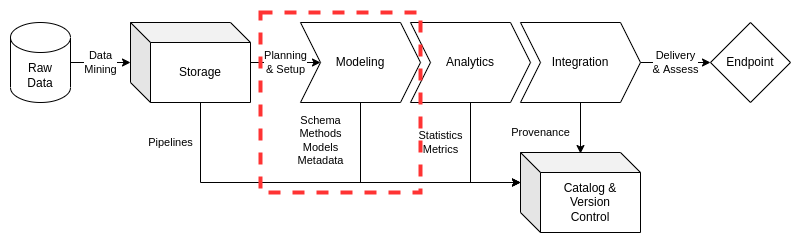

# Modeling

Consistent and rigorous modeling of data is a critical element in data management practices. With considerations of hybrid data architectures across multiple information systems, institution's need to ensure the data management team can reduce time to delivery through optimizations in model production, enhancement, and abstraction for reuse across data products and services. This includes improved documentation, version control, and quality assurance practices to accelerate model planning and setup. Data schemas, methods, and models are to be documented and stored for future use while enabling improvements in metadata outputs for enhanced data provenance and lineage assessments.

This document will set a baseline for data modeling practices, directing data engineers to content management practices essential for detailed data models implementations. ciuTshi's data management practices draws from DAMA[1](modeling/references) and other resources. For additional context on this document's sections, refer to the references section.

## Challenge

Institutions invest heavily into data assets and multiple data architectures to meet their mission requirements and goals. As a result, they require a simplified modeling system to ensure repeatable practices which can be applied across data architectures for inter-system compliance. This modeling system entails consistent and rigorous practices for their data assets which can be accomplished with limited technical personnel who are often constrained by limited timeframes. A system of model cataloging to accelerated data discovery, analysis, and integration is critical to any data strategy, improving delivery, security, and quality to internal customers while enhancing transition of capability to data partners and external stakeholders. Accurate and precise data modeling is the linchpin in the data management system, requiring increased and persistent scrutiny to ensure alignment between storage practices, customer requirements, and system architecture policy. Adoption of these practices results in a cumulative data modeling paradigm, improving processes for repeatable data requirement tasks while enabling the data management team to produce more complex and challenging data models for customers and their projects' portfolios.

## Goals

* Provide guidance on model planning and setup, grounded in model lifecycle management, resulting in templated approaches to processing data assets more rapidly, accurately, and consistently for data customers
* Enable documentation of data asset modeling resulting in consistent and rigorous content on schemas, methods, models, and metadata
* Define a modeling paradigm that improves data models over time resulting in review and management of models for implementation across data architectures while minimizing labor and overhead costs through their optimization

## Processes

### Preliminary Tasks

#### Security and System Compliance

Refer to the security and the content management documents for guidance and templating of data asset modeling content. This should cover considerations on data access and guiding policies.

#### Role and Responsibilities

These are the roles currently associated with data modeling practices:

* Data Manager
* Deputy Data Manager
* Data Management Team
* Data Engineers
* Data Owners
* Data Stewards

Refer to the institutional content management documents for roles and responsibilities associated with information system access, specific data architecture implementations, and their associated roles.

### Lifecycle Management

Lifecycle management for modeling starts with planning and setup once all storage requirements are satisfied. The planning and setup will dictate the action plan for requirements and tasks that will guide the data management team on development of essential modeling elements. At a minimum, the modeling phase must produce documentation on methods and models that produce valid schema and metadata for a data asset or data asset collection. The action plan will be reflected in the requirements and task management setup while schema, methods, models, and metadata will go to their respective locations in version control and the data catalog system(s).

#### Planning and Setup

The planning and setup phase are essential for efficient operations in modeling and processing the data curated during the storage phase. Ensure that the raw data and its associated document are in place and reflect the tasks as detailed in the requirements for the data asset. If there are gaps in the raw data or storage, confer with the data manager for clarification on knowledge gaps or inconsistencies. If immediate resolution cannot be achieved, additional requirements and customer workshops may be required to proceed to model execution and delivery.

Once requirements are clearly defined and the tasks are understood, the data management team will proceed to setup resources and action essential tasks for modeling the data. Schemes and schemas will be produced predicated on methods that are supported by valid logic and/or empirical research. The schema, methods, and models should be scoped to ensure essential metadata fields are defined and populated prior to processing. Once these essential tasks are complete and verified by the data stewards, owners, and data management team, setup of technologies on the appropriate systems' data architectures will be completed. The setup of modeling resources will be scoped and documented per the requirements which may include the size of the data asset, timeline to delivery, and security/policy restrictions that may complicate or delay the modeling of the data asset.

#### Data Characterization

The essential elements of data modeling constitute the data asset's characterization. The conceptualization and documentation of schema, methods, models, and metadata enable detailed consideration and execution of setup of resources based on what entities, relationships, attributes, and attribute domains exist in the data. These characterizations not only dictate the types of analytics and integrations to be implemented, but enriches the evolution of metadata tags and models which enhance knowledge discovery throughout the data management and data operations infrastructure. These elements of information lead to better understanding of organizational investments and project scope through enriched data lineage and provenance as these characterizations directly impact proceeding model efforts for data operations effectiveness.

##### Schema

During the requirements phase, a workshop with the data owners and/or customers establishes the conceptual model of what the data represents. This may also affect how the raw data is stored and upon which systems it may be accessed. These factors have direct implications on what schemes and schemas may be optimally used based on the problem being addressed and how the customer plans to explore said problem.

At a minimum, documentation (including diagrams) of the schema should be produced, reflecting the scheme selection, data_types, and its association to the methods and model that will guide its processing. Additionally, data and entity dictionaries should be produced to maintain provenance for the model and its affects on the processed data asset.

##### Models

Models determine and are determined by the data asset, how the data asset was produced, and by whom the data asset was curated and delivered. At a minimum, the requirements process should have captured these aspects of the data for consideration in the planning and setup for modeling:

* _Conceptual_ models are the "high-level, real world" representations of concepts as situated within the customer data requirements
* _Logical_ models are the detailed representations of data requirements connecting data field details to the conceptual model
* _Physical or canonical_ models are the detailed technical solution derived from the logical model: the final schema that will dictate the setup and processing of the data

These should all be documented to ensure the connection between data lineage and data provenance from raw storage to integration endpoint are understood. This metadata bolsters explanation of the data analytics given to the customers and stakeholders.

##### Metadata

Perhaps the most important longitudinal feature for a data asset is its metadata history. It is critical that any data asset that is processed by an institution or project maintain its metadata lineage for future utilization and accountability within information system security and policy standards. Details on the data assets such as labels, tags, requirements connections, transfer information, customers, stakeholders, owners, stewards, and datetimes for all these will assist in not only the modeling and processing phase, but will assist leadership in assessment of value for a given data asset. This will aid the data governance board in efficient management practices through sufficiently supported data asset actions such as transition or deprecation.

#### Transformation and Normalization

Once the data characterization is as complete as possible for a given data asset, setup should be completed and verified for processing to begin. Challenges to the model and methods should be addressed prior to execution of processing the raw data into the determined schema and metadata objects for analytic input and integration delivery. If there are outstanding challenges or addendum to the requirements, clarification should be obtained prior to processing the data asset.

Depending on the data architecture and information systems upon which the data asset is processed, the data management team needs to capture the artifacts of the transformation and normalization processes. This includes documentation of any effects normalization practices have on the final data representations, outlining how any abstractions occurred by particular fields may affect analytic processes and utilization at endpoint. Logs and other resource artifacts may assist in these efforts, so documentation of these in the model along with the code and tests are essential for tracking any repeat processes in the current requirement period or refreshed processes in the future. The documentation of transformation and normalization should at a minimum reflect where the data engineer and data asset started, what was done, and what the final model output should look like and adhere to.

#### Methods

ciuTshi suggests forward engineering approaches to data asset modeling: driven by refined requirements to optimize process security, quality, and delivery. Planning and setup should pursue analysis of analytic and integration requirements in the context of existing documentation for model development, co-opting existing practices while ensuring access to the raw data and its documentation. Methods should bolster justification for schema selection, modeling approaches toward realizing the selected physical model, and transformations of the data to best represent the entities, relationships, and attributes established in the conceptual and logical models (including domains, keys, and other essential elements of the scheme, schema, and model). These elements of the model should be reviewed and validated by the data management team to ensure requirements from the data owners and stewards are reflected in the mastered data output and its documentation. Ensure the attribute details are consistent while verifying reference data objects in the validated model back to the raw data. Efforts should be made to conduct limited test run to ensure the model is functional prior to runs of the complete data model process.

If the model is methodological sound, passing all quality and requirements checks, the output will then proceed to the analysis and integration phases.

##### Sampling

Sampling is essential for many large datasets. The size of these data sets can make quick experiments and initial EDA an overwhelming task for data analysts and make handling of the data inefficient from a prototyping perspective. As a result, documented and valid sampling techniques are required as part of the modeling phase. Samples of data will be included in the data catalog for access by analysts and scientists. Following initial analytics efforts via the sample(s), requests can be made for the entire collection or a larger, more specific ensemble sample for their final endpoint. These master data samples should improve EDA efforts for stakeholders and customers while reducing the resource loads for re-processing of large data assets within more predictable timelines. The sampling method will be documented in the data catalog and the version control location for the model.

##### Synthetic Data

Synthetic data may be a critical consideration for a data asset. Though not currently performed by many institutions, data modeling processes may involve handling of PII and other sensitive information. As a result, there is solid justification for a synthetic data requirement: data that accurately mimics a data asset for use within and between data architectures and secure information system. 

##### Entity Resolution

Advanced modeling requirements for institutions and projects may require data management to enhance and optimize the connections within and between data assets. If connections between data assets exist, there may be a solid justification to resolve these connections between their data models. As a result, a requirement for entity resolution may be needed to enhance later data modeling efforts.

(modeling/references)=

## References

Number|Reference
--|--
1|Henderson. D., Earley, S., Sebastian-Coleman, L., Sykora, E., Smith, E. (Eds.). (2017). *DAMA-DMBOK: Data management body of knowledge (2nd Ed.).* Basking Ridge, NJ: Technics Publications.
