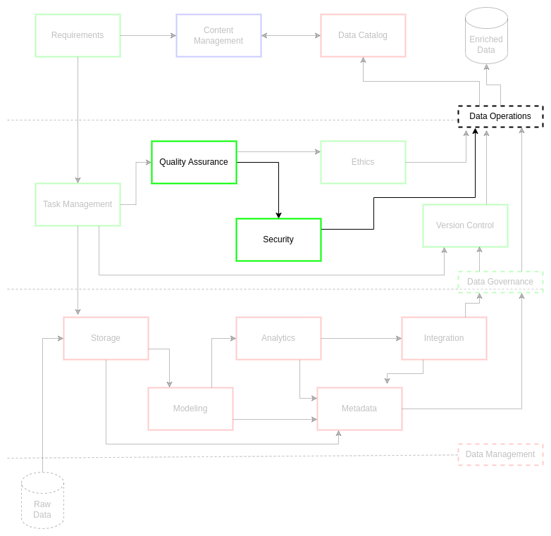

# Security

Security is a critical component of data operations. Control of access to data architecture and data assets is a primary consideration for any data management task or data engineering solution. However, institutions do not want strict access controls to hinder agility and speed to decision making for stakeholders and customers. As a result, data security must leverage internal and external concerns from stakeholders, regulations, and business needs to guide best security practices for data assets.

Data security is largely data strategy-driven. Through a data governance board and governance structures, an examination of data assets, projects, and business requirements can lead to effective guiding policies. These policies must stand in rigorous compliance with regulations without adding unnecessary process complexity, ultimately leading to delays in delivery. This complexity is controlled through a balance between shared efforts from the data management personnel, data architecture professionals, and the information technology administrators for the institution. This concerted collaboration is at the core of the data strategy, adding strength to the organizations overall data security.

Collaborative vigilance is the key to good data security practices. The collaboration across data systems and teams is only one level in data security. Data security is responsive to stakeholder security practices, international regulations for data and systems security, requirements for data assets, and contractual arrangements between data owners, data stewards, and customers. These relationships establish the baseline for roles and responsibilities around legitimate access for personnel and teams. This baseline also represents the risk mitigation measures put in place by stakeholders, ensuring appropriate practices surrounding the data are applied within compliance standards. This focus on people and practices lends itself to layering risk mitigation for data assets. This concerted effort across the data systems by data professionals fosters institutional model growth with "security first" data asset practices.

This discussion on data security requires us to define a few key concepts: vulnerability, threat, risk, and risk classification. A vulnerability is a weakness or defect in the system[1](security/references). A threat is a potential action that is or can be taken against a system[1](security/references). As already talked about at length, a risk is a potential to lose something[1](security/references). A risk classification is a system of measure put in place to assess the type and effect of a risk (e.g., the risk sensitivity) [1](security/references). These classifications are deeply rooted in all operations, requiring persistent policy and training shifts to account for the latest risks. Data security also depends on persistent adjustment, seeking solutions to risks accounting for vulnerabilities and evolving threats.

Data security processes, via carefully implemented data strategy, must be integrated across data operations through governance and management practices. Data operations depend heavily on the move to integrated metrics and automation[2](security/references). As a result, humans-in-the-loop must understand that a lack of testing and security around these factors increase vulnerability and risk. Practices such as data governance board reviews on security policy[3](security/references) alleviate this in several ways. First, it makes data security a leadership and culture goal. Second, it enables adaptable roles and responsibilities for data practices to shift governance policy for rapid data management impact. Third, data security positively impacts business outcomes for institutional stakeholders, building trust in data products and systems.

## Challenge

ciuTshi suggests optimal security practices at the forefront of all data asset management. This encompassing approach is the result of efficient data operations guided by security-centric data governance practices. This approach to data security requires proper policies and coordination with information technology management (ITM) and data architecture teams to ensure access and compliance. This compliance model is implemented through guidelines that are adaptive and effectively monitored, covering authorization, access and audit practices to and between all systems. Security outcomes and metrics must also integrate with content management standards (CMS) and other on-site and online security practices. This network of connected security communications guides data asset management within secure data architecture implementations for stakeholder risk mitigation and customer safety across numerous secure systems.

## Goals

* Enable appropriate accesses to data assets for stakeholders and customers
* Prevent asset and system compromises through adherence to regulations and policies on privacy, protection, and confidentiality practices

## Implementation

Due to institutional regulations associated with security practice implementations, much of the implementation details should be stored on content management systems at the appropriate security access levels. Security personnel should also make security and classification training available which should be refreshed yearly or with policy changes.

### Roles

* __*Stakeholder*__
* __*Data Owner*__
* __*Data Steward*__
* __*Data Manager*__
* __*Information Security Manager*__
* __*Information Assurance*__

### Security Guidelines

There are several data security standards to consider in a complete data asset workflow. Coordination must be made to establish and regulate access to the data assets and its associated data systems. Security managers, information assurance, and data stewards must have purview into these practices, auditing the practices for compliance. There must be a way to authenticate data asset handling for the data owner to demonstrate rigor to stakeholders and data owners: often via a series of audit logs and metrics found in content management and data managements systems. These logs and metrics indicate authorization and entitlements compliance as established in the requirements and is enforced through roles within data operations.

Requirements not only drive initiation of secure data operations, but they ultimately guide data governance in execution of secure data management practices. Data system implementation is a direct result of requirements. These requirements establish the profile of the data assets and a set of tasks through which security standards are met at each phase. Data operations and its data governance practices establish and evolve roles and responsibilities to ensure that the data asset at each of these phases is handled to a high standard of ethics and quality in line with stakeholder and customer expectations. This underlies the institutions business model through fostering trust in data asset practices and delivery standards to project managers and stakeholders.

#### Data Masking and Synthetic Data

Due to the security considerations for individual or combined data assets, obfuscation across secured system levels must be part of the requirements security discussions. This includes development and evolution of synthetic data for prototyping. The use of synthetic data aids in identity managements, controlling personally identifiable information (PII) and secure access to the data asset. These synthetic productions and links will be noted in the metadata for the data asset.

#### Security Team

Data asset security is a concern for three initial internal groups: data management; data architecture; information technology management. ITM and data architecture must approve and be able to maintain vigilance of data asset movement in their systems. This is not only a security matter, but a matter of accreditation of systems and compliance with community partners and data owner standards. This is also a cornerstone of cumulative metrics for data governance and data management practice improvement. As a result, these data teams must leverage several standard elements:

* Clear roles and responsibilities for data operations, governance, and management
* Controlled credential management in line with roles
* Metadata tracking with annotated metrics and security indicators (e.g., benchmarks and tagging)

#### Training

All personnel involved in data operations should be aware of security standards and practices. Each classified system will have an associated data operations content management system with its associated security documents. These documents cover systems associated practices, data policies, mission benefits, and additional vendor information with links to their training requirements per data asset.

(security/references)=

## References

Number|Reference
--|--
1|Henderson. D., Earley, S., Sebastian-Coleman, L., Sykora, E., Smith, E. (Eds.). (2017). *DAMA-DMBOK: Data management body of knowledge (2nd Ed.).* Basking Ridge, NJ: Technics Publications.
2|Atwal, H. (2020). *Practical dataops: Delivering agile data science at scale.* UK: Apress.
3|Ladley, J. (2019). *Data governance: How to design, deploy, and sustain an effective data governance program (2nd ed.)*. San Diego, CA: Academic Press.