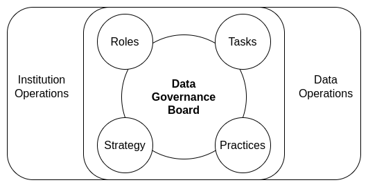

# Summary

Modern institutions demand holistic and well-integrated approaches to data-driven decision-making: faster mobilization of data assets to produce value increases the potential for future success. Advances in computational power, data systems, and algorithmic approaches for complex data analysis increase the likelihood that organizations can effectively identify process improvements and knowledge gaps with increasing accuracy. However, this incredible set of cumulative data processes is contingent upon data quality and data professionals' abilities to use and enrich their data assets over time. Researching and using archival or underutilized data assets to answer new questions, often lacking critical contextual information, is a timely and costly affair. There is then the issue of modeling new data assets consistently within and between data systems and data teams: making data operations[1,2](summary/references) increasingly expensive for organizations. This unnecessary hurdle often drains data professionals of their time and productivity in their specialization areas. There are many data engineering solutions to resolve these challenges: the problem is that many organizations rush to use these solutions without adequately planning how to consistently and rigorously leverage them to produce a return on investment for institutional leadership, stakeholders, and customers.

ciuTshi is an adaptable data operations framework, leveraging intersectional practices within information technology management (ITM), data architecture, content management, data management, and data governance to sustain an organization's unique data environment. Additionally, ciuTshi leverages the proven systems of Agile, Lean, and DevSecOps (development, security, and operations)[2](summary/references). These knowledge domains specialize in particular forms of process execution efficiency, and they adapt well to multiple data application spaces. A data strategy outlines the data environment and its challenges in detail, which directs an organization's systemic shifts to enhance the utilization of data assets. These enhancements drive change and opportunities within the institution's project portfolio while enabling evolution and support for the existing business models[3](summary/references).

ciuTshi primarily focuses on content management, data governance, and data management practices to grow and enrich flowing metadata for process improvement of data asset lifecycle management. This effort involves continuous selective development and integration practices for data products, starting with specific requirements outlined by a customer or stakeholder and ending in a well-documented data asset delivery. Effective collaboration and institutional cooperation are at the core of ciuTshi's continuous process improvement. These efforts entail a deep connection between ITM, data architecture, and data asset management personnel: each group working together to encourage efficient communication on system requirements while establishing roles and responsibilities with delineated data governance tasks. As a result, ciuTshi acts as a connective fabric between the several groups, permitting constructive dialogue towards leadership impact[4,5](summary/references).

ciuTshi allows data teams to get their time back and institutions profit from it. Encouraging data professionals to document processes and build metadata is insurance against future data system challenges, which is why using ciuTshi consistently and rigorously is crucial. ciuTshi's comprehensive yet straightforward ensemble approach to data asset enrichment eventually improves productivity and reduces technical debt when leveraged across institutional systems and other organizations. The customer and institutions know their challenges, but ciuTshi aids in identifying the challenges of tomorrow through the application of data quality standards today.

## Terms

Here are a few key terms we will use throughout this document:

* __Institution__ - is the organizational entity to which the data operations practices enable with data management, data governance, and content management models. Institution is used interchangably with term Organization.
* __Customer__ - is the person or group that is the focus of the institution's data product delivery.
* __Stakeholder__ - is a person or group associated with the institution and is impacted by data operations outcomes. Stakeholders often have significant impact on requirements and product delivery.

## Roles and Responsibilities

Additionally, here are some of the key roles we will refer to throughout this document:

* __Science & Methods__ - is a category of personnel who focus on data science and other research methodologies. These personnel are often internal comsumers of data products and data assets, acting as intermediaries between technical and non-technical institutional personnel.
* __Analytics__ - is a category of personnel who focus on data analysis and other business intelligence foci. These personnel are often internal comsumers of data products and data assets, acting as intermediaries between technical and non-technical institutional personnel.
* __Program Management__ - is a category of personnel who focus on management of institutional programs which consume data products and/or data assets. Program management leverages project context to request specific data deliverables.
* __Project Manager__ - is a category of personnel which acts as an internal customer for data asset requirements. Project managers request data asset and data product deliverables through data management.
* __Project Lead__ - is a category of personnel which assists the project manager with their duties.
* __Project Team__ - is an identified group of program managers, project leads, scientists, analysts, and other project personnel essential to the data project scope and delivery.
* __Data Management__ - is a category of personnel who focus on the management of data and metadata assets.
* __Data Engineering__ - is a category of personnel which facilitate data management through processing and curation of data and metadata assets. These personnel often work closely with data architecture and information technology teams to enable data management processes. 
* __Data Manager__ - is a category of personnel in charge of data management and data engineering practices applied within specified data architectures. This responsibility includes security and ethics practices central to institutional policy and data owner agreements.
* __Deputy Data Manager__ - is a category of personnel which assists the data manager with their duties.
* __Data Management Team__ - is an identified group of data managers, deputy data managers, data engineers, and other data management personnel essential to the successful delivery of a data asset or data deliverable.
* __Data Engineer__ - is a category of personnel which facilitates data management and data governance processes through data engineering practices. This responsibility includes guiding master data management within data governance for optimal data product delivery from clearly defined requirements.
* __Data Owner__ - is a category of personnel that owns the rights to the data asset and shares, sells, or licenses said data asset to others for specified utilization.
* __Data Steward__ - is a category of personnel in charge of moving a data asset into data operations and maintaining vigilance of data asset utilization within data management. This vigilance does not indicate they are involved in data management, only that they maintain their accountability of the asset within the terms of agreement they have with the data owner.
* __Information Security Manager__ - is a category of personnel in charge of content and knowledge management pertaining to security practices for a specified data asset. This management includes observation of data asset transfers within security and policy boundaries.
* __Information Assurance__ - is the cummulative accountancy of quality assurance practices including security and ethics encompassing requirements and legal agreements pertaining to a data asset. Information assurance is a level of a quality control that ensures data and information security are within compliance and that reflections of this compliance are captured in the data asset's metadata.
* __Legal Counsel__ - is a category of personnel which facilitates review and guidance on the legal limits of data asset acquisition, utilization, and delivery to entities internal and external to the institution.
* __Trusted Transfer Agent__ - is a category of personnel which assists the information security manager with authorized and valid data asset moves within and between data architectures and information technology systems.
* __Product Owner__ - is a cateogry of personnel which submits finalized requirements into the task management backlog for a data product. The product goal should be clear prior to submitting valid requirements. Clear goals assist in prioritization of backlog task for sprints.
* __Scrum Master__ - is a category of personnel which coordinates and manages sprints. The scrum master manages the team in a positive and productive manner to ensure tasks are completed within the sprint timeline. This includes training and coaching of team members. Scrum master also manages communication and conflicts between the product owner, sprint team, and the organization as requirements and product expectations shift.
* __Scrum Team__ - is a group of task management personnel which executes on project sprints through iterative task planning for a data product. These members assist in defining *Done* with the Scrum Master by guiding accountability and quality standards through daily checks and adjustments.

## Challenge

* Establish an adaptive collection of data governance practices
* Maintain consistent storage and processing of raw data
* Enforce rigorous modeling of various heterogeneous data
* Maintain lineage of the processing models
* Provide rapid endpoint delivery of data assets
* Document and store detailed metadata through data cataloging practices
* Enforce content management of data engineering efforts within roles and responsibilities for continued learning

## Goals

* To drive improvements in the automation of high-quality data management processes with secure parity across multiple systems
* To enhance and integrate requirements for data operations with institutional operations
* To improve management of data architecture and personnel resources through implementation of clear KPIs & metrics
* To encourage data project process improvement through detailed version control and documentation practices
* To contextualize and enable data-driven systems
* To optimize storage, processing, and delivery of high quality data assets
* To securely obtain, monitor, and share data within appropriately secure environments
* To capture the provenance and use of data throughout its lifecycle
* To ensure data is adding value through process metrics and data analytics

## The ciuTshi concepT

ciuTshi is as much about data people as adaptable data operations. The metadata this framework collects derives information surrounding data processes from the positions and perspectives of the data professionals themselves. To neglect the ethnography of data management not only impededs more complex and critical aspects of data ecosystems, it reduces metadata to yet another inert data asset to be managed. A salesperson would likely not sell cars without knowing about drivers, road networks, or laws: why would you catalog data without understanding who's using it, why that matters, and how the data will flow to and from them over time and through systems?

ciuTshi attempts to resolve metadata challenges through integrated practices. This approach accounts for dimensions beyond data operations, making them part of the data operations scope of practices. The projects that use the data and the customers who will consume data products and services must be considered part of data governance and data management models for a given data project. All people and systems produce useful data points which may prove critical within modern data-driven institutions. With the levels of increasing institutional dimensionality and scale of data growth, institutions need a data operations framework that functions under these assertions.

ciuTshi conveys an understanding that we all have data challenges of varying dimensional complexity. The questions people ask and the knowledge needed to answer those questions are what we as data professionals strive so diligently to produce daily. As a result, metadata content should cumulatively constitute a dialogue on what we can and should do to make collective knowledge possible. This effort will vary from organization to organization, many of which who have made attempts to produce knowledge systems from the semantic web era to modern-day distributed knowledge-base systems. As a result, ciuTshi forwards a modular, technology-agnostic approach to metadata generation and curation that could be executed at varying levels of technology access without compromising its effectiveness.

ciuTshi takes a nested approach to data operations, keeping data management working efficiently at the core with data governance practices buffering the environmental effects that guide data management evolution. This approach is underlined by two simple principles: keep things simple and learn from iterative failures. These principles guide a data operations culture that encourages rapid prototyping and cumulative knowledge management practices as a driver of data management growth through a nuanced cataloging of data governance and data architecture implementation practices.

This nested approach premits variable control of evolving systems. This variability requires distinct delineations between roles and responsibilities that any capable person can fill in the course of completing data operations tasks. This ability to fill multiple roles is essential as many institutions may have personnel changes or shifts that limit the number of qualified data management professionals that can be assigned to a given project. To answer this personnel challenge, ciuTshi forwards a flexible framework approach with modular data governance practices, each with clear roles and responsibilities. Due to the deepening connection between data operations and institutional operations, the tiers of roles and responsibilities need to be mutually managed to ensure data requirements can efficiently realize project expectations. This need is managed by a data governance board: representatives from data and institutional operational areas that periodically review integrated data practices to ensure their respective areas of responsibilities are constructively evolving.

This fusion of data management approaches allows ciuTshi users to work flexibly around blockers in parallel domains. This parallelism advances compliance towards consistent and rigorous data governance of data science practices for data-driven decision-making and other advanced data practices. Compliance for consistent and rigorous practices begins with documenting and structuring data management within data governance and data operations. These tiers make internal data management processes much quicker and cost efficient while drastically reducing time to delivery for data products and services. This system also mobilizes efficiencies towards optimized changes in the data operations system and data environments. Mobilization occurs through structured requirements and adaptable task management practices which are version controlled and analyzed, enabling system and architecture optimization. This optimization allows institutions to align talent and skills to requirements and tasks, improving data processes and collaborative efforts on rapid prototypes across multiple systems and a broader array of data products and services for internal customers and external stakeholders.

### Content Management

ciuTshi begins with content management. This decision is largely due to it being the common denominator for institutions across all levels of personnel. Not everyone in an organization is technically capable nor are they expected to be trained in data engineering practices. What should be expected from data and project personnel is a dedication to communicating their practices to their colleagues, helping them understand the complexities, challenges, and achievements made through evolving data operations processes. This understanding, written in a common and accessible manner, aids leadership and other institutional divisions in seeing and appreciating the value produced through daily data operations. All the metadata, code, and data system artifacts need to be accounted for under project-centric mechanisms such as a content management system (CMS). This dedication to concise technical documentation ensures a simple and straightforward explanation to non-technical staff how data management and data goverance add to an improved understanding of their critical contributions.

#### Labels, Tags, and Annotations

Throughout the use of ciuTshi data operation modules, the metadata rubrics may require the application of tags, labels and/or annotations. Institutions know themselves best and as a result, they should take time in conceiving a consistent system for data project, management, governance, and operation tags and labels. Tags may include keyword sets used to add special indexing to data elements within the metadata for search or qualititative analysis. Labels may include project names, security levels, data systems, or other critical policies the institution is required to observe. Annotations are large strings, often a sentence or phrase to extend the meaning of a tag or label.

type|examples
--|--
tag|`entity type`, `process`, `attribute`
label|`classification`, `project`, `policy`, `access group`
annotation|`short description`, `desclaimer`, `warning`

### Data Operations

ciuTshi takes a grounded approach to data operations[1,2](summary/references). The primary focus is to have a data strategy-driven data operations planning cycle. These cycles run in concurrent two year periods in which practices and tasks are managed across shifts in ITM, data architecture, and governance operational frameworks. Each data strategy should focus on improving three key areas of data governance and data management: DevSecOps for data products and services; key performance indicators (KPIs) and framework metrics; and institutional growth.

#### Data Governance

The fundamentals of data operations are found in established and efficient data governance practices. As a collection of buffer practices, governance protocols ensure that data management and engineering are executed at maximum efficiency. These same protocols guide management and leadership in their planning and delivery schedules through reliable and accurate data operation KPIs and analytics. Data governance is the glue that holds together data management and warehouse systems within moving data operations relationships.

ciuTshi takes a grounded approach to data governance[1,4](summary/references), focusing on tasks essential to successfully leveraging data assets for institutional results. The data governance modules within data operations are structured to support functionality between data operations and data management through three meta-concepts: data literacy; data-driven business models; and effective data delivery.

##### Data Governance Board

A sustained data management system requires persistent institutional engagement. Leaders in data management[1,2,3,4](summary/references) assert that such involvement requires a full spectrum of data personnel representation to ensure data management produces positive results for the institutional business models. This personnel and leadership representation is critical as data asset acquisition and management may cost millions of dollars in near- and long-term investment. Therefore, an institution should have a group of individuals from across the data consumer spectrum to observe and guide data operations mutually with the data architecture, finance, and project operations teams.

The data governance board does NOT affect data management. Data management is the sole purview of the data management team within data operations. The data governance board interacts with the data governance practices which buffer data management. But again, data governance changes are still the purview of data operations. This essentially means that the board's purpose is largely to bring challenges to the attention of data operations so that the frameworks and practices evolve with the trajectory of the institution's vision, mission, and goals.

A data governance board must understand that practices are not tantamount to goals. The board should leverage tracking and documentation to support the institution's data and project teams in their work. This primary and fundamental consideration is what makes shared involvement in data governance a critical factor in how organizations mobilize data asset value towards goal realization. Goals are always shifting and as a result, members need to evolve the value they bring with the intent to constructively shape the institutional data landscape for strategic success.

##### Data Strategy Biennial Report

Data operations leadership and personnel are responsible for drafting a detailed improvement plan for data governance and data management practices. This plan is delivered to institutional leadership in the form of a report every two years. This report covers several key areas for data operations, ensuring that evolving practices meet or exceed the requirements for present and projected data tasks.

##### Data Governance and Data Architecture

The relationship between data operations and data architecture is paramount. In building a functional data governance framework that supports data operations and data management, data architecture and its role in data operations must be clearly understood. Data management falls within data operations and is responsible for the ownership and stewardship of data assets. Data architecture often falls within ITM and is responsible for data systems within which the data assets exist. This tightly woven condition makes data governance a careful negotiation between the assets to be managed and those that manage them at varying scales. As a result, the relationships that constitute the foundation for this negotiation must be constructively grown for the institution and its business model. This growth and the requirements that emerge in that process will elucidate the nature and course of data architecture for data management.

### Data Management

Data management is foundational for any data-driven organization[1](summary/references). These organizations produce or acquire data assets which require storage, processing, and lifecycle management. Data management practices guide data curation and processing to ensure that the organization and its stakeholders are obtaining a necessary return on investment (ROI). This ROI requires consistent and rigorous data management practices within a broader scope of data governance and data operations. These broader systems of best practices align personnel and business requirements to projects for effective delivery of data products and services to decisionmakers and stakeholders.

> In 2009, DAMA International produced the *DAMA Guide to the Data Management Body of Knowledge* book which compiled the best practices in data management system implementation[1](summary/references). The guide (updated in 2017) covers principles, challenges, and solutions for institutions advancing their data management practices for organizational growth. As suggested by CMU's capability maturity model[7](summary/references) (CMM), establishing a system of best practices is the first step on the path to optimizing an organization's data strategy and enabling its stated mission. DAMA combines data management practices with the broader scope of data governance which encompasses the majority of general data management concerns for a CMMI-compliant organization. These data practices balance each other and are all part of an established and functional master data management (MDM) system.

Data models must be interpretable within and across data sets. This interpretability is largely contextualized through consistent metadata practices. This understanding of context is fundamental to data management: data is created as a result of knowledge and methods being applied to domain-specific research efforts. However, data has a shelf life which must constantly be tracked and assessed for its value in analysis and decision-making. Additionally, data quality varies broadly from vendor to vendor. As a result, data management for acquisition and utilization applies consistent and rigorous planning practices to ensure models and integration most accurately represent the true context of the raw data and its representations. This is contingent upon persistent metadata curation, data refresh, and analytic improvements to ensure utilization up to or beyond the end of lifecycle.

> A complimentary standard for DAMA is ITIL[6](summary/references). ITIL 4 focuses on four key service dimensions in order to enable a sustainable service management system through clear value definitions and deliverables. This approach to service management situates people, technology, stakeholders, and practices as critical factors in value production for a product or service. ITIL then builds their service value system around these factors and their context. This value definition enables the system to mobilize optimal ROI predicated on clearly defined demand or opportunity through consistent implementation of rigorous governance, principles, and improvements.

### Framework as an Ontological Unit of Analysis

> The goal of metadata should not be to have more data, it is to build knowledge about the information your data facilitates.

Why go to all the trouble of adopting and applying ciuTshi? The reason is simple: the purpose of building data context is to build and leverage information that drives institutional knowledge and leadership decision models. The more this data practice is observed and the more it improves over time, the less work and time is needed to repeat the same tasks. This liberates data professionals to experiment, update, and improve data systems without compromising or neglecting standard data practices. Additionally, the consistent and rigorous application of metadata practices within MDM and data warehouses permits an organization to leverage knowledge as an ontological unit of analysis for the organization itself. Agents, actants, processes, and entities specific to organizations are present as digital twins within knowledge-base systems: an accurate reflection of themselves in billions of contextualized records across thousands of data collections. Not only does this bolster the critical use of existing data-driven systems, it allows leaders at all levels of data and institutional operation to consider the vision, mision, and goals for their institution's tomorrow.

(summary/references)=
 
## References

Number|Reference
--|--
1|Henderson. D., Earley, S., Sebastian-Coleman, L., Sykora, E., Smith, E. (Eds.). (2017). *DAMA-DMBOK: Data management body of knowledge (2nd Ed.).* Basking Ridge, NJ: Technics Publications.
2|Atwal, H. (2020). *Practical dataops: Delivering agile data science at scale.* UK: Apress.
3|Axelos. (2020). ITIL foundation. Ely, England: IT Governance Publishing.
4|Ladley, J. (2019). *Data governance: How to design, deploy, and sustain an effective data governance program (2nd ed.)*. San Diego, CA: Academic Press.
5|Berkun, S. (2008). *Making things happen: Mastering project management.* Sebastopol, CA: O'Reilly Media Inc.
6|Axelos. (2020). ITIL foundation. Ely, England: IT Governance Publishing.
7|Capability Maturity Model Integration (2021). Obtained from https://en.wikipedia.org/wiki/Capability_Maturity_Model_Integration.
